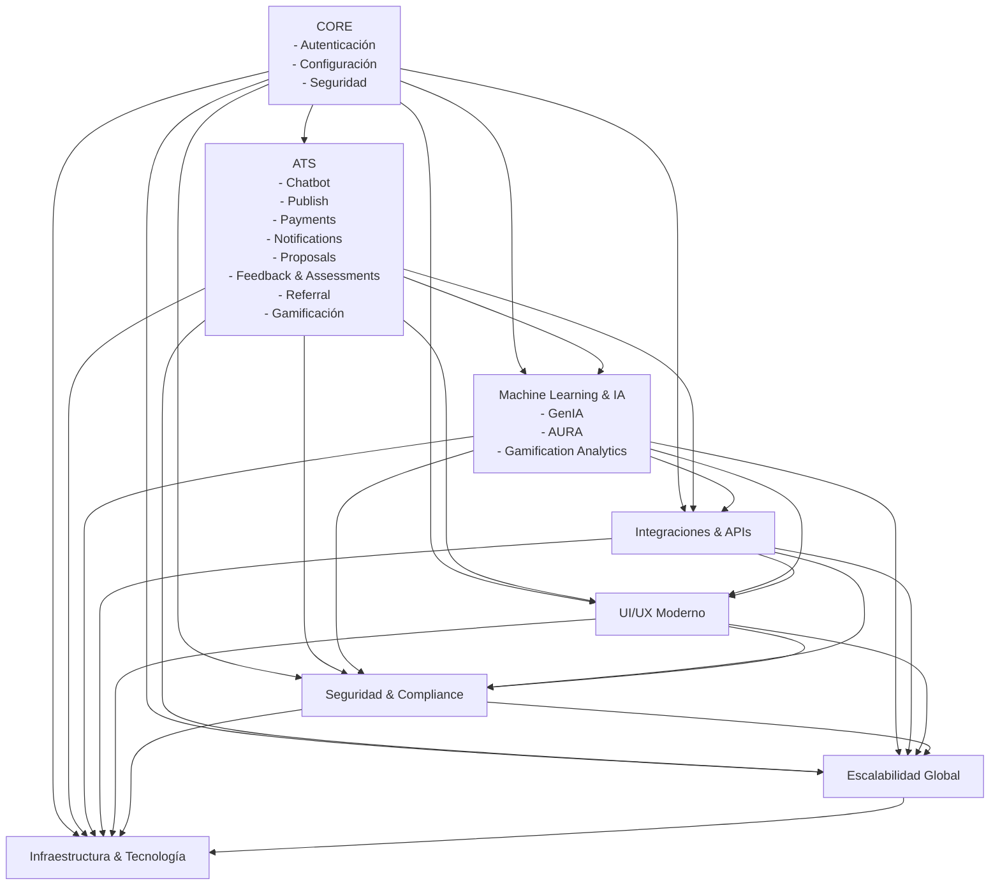
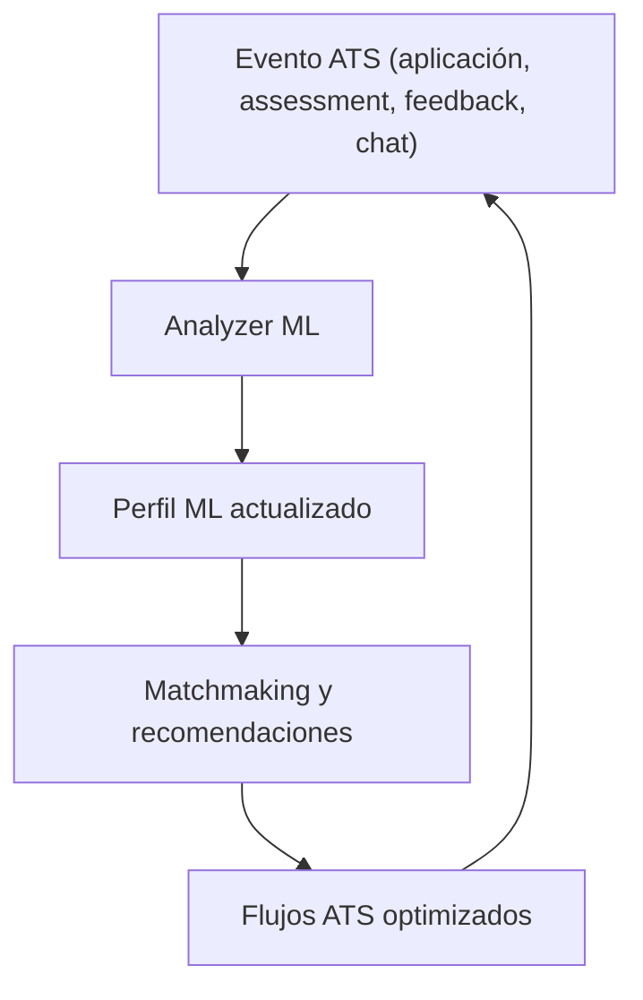
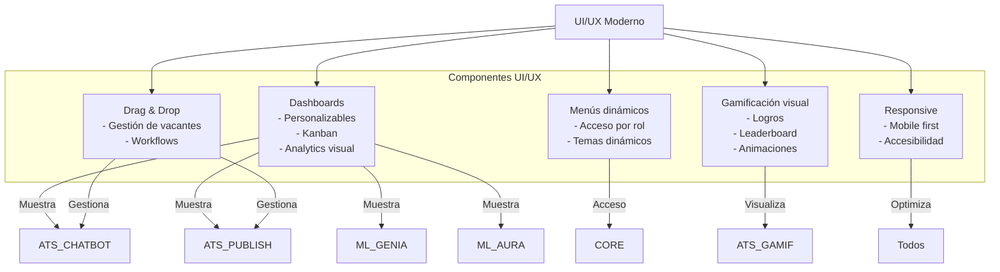
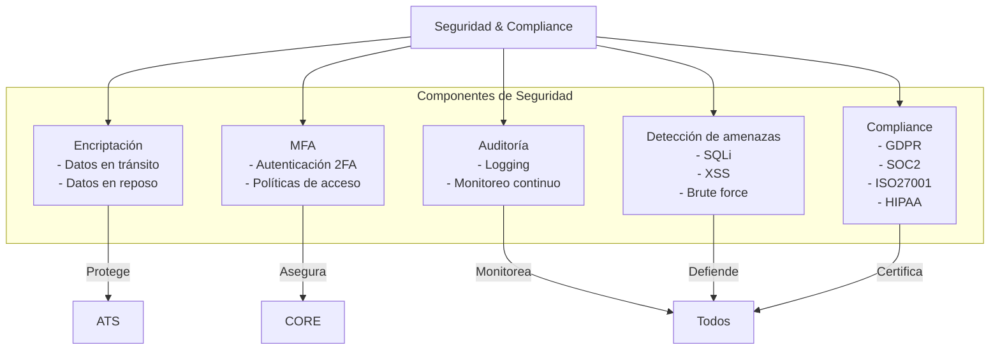
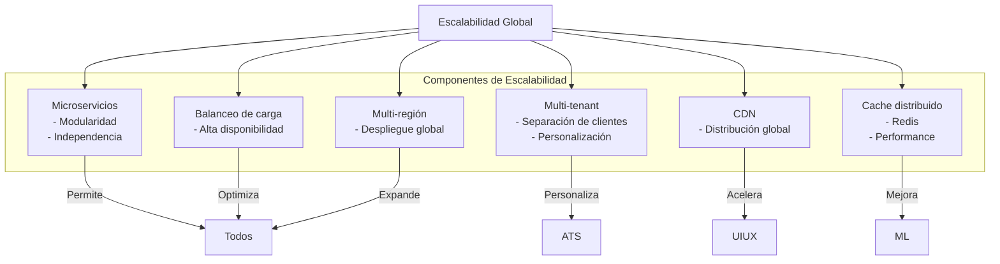
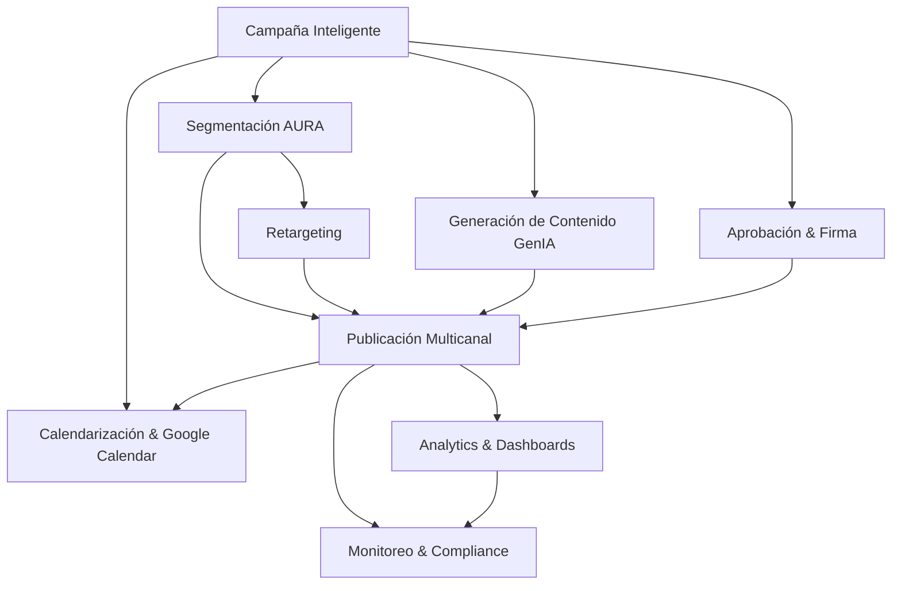
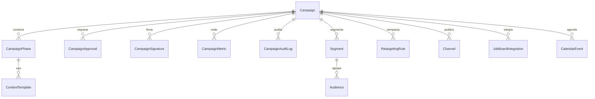
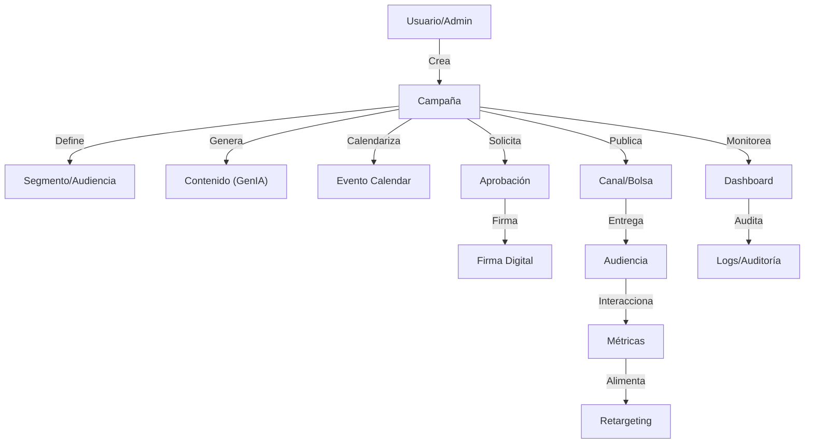
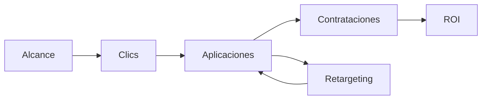

# Grupo huntRED® - Plataforma Inteligente de Reclutamiento, Talento y Automatización

<div align="center">
  
  <h1>Grupo huntRED® AI Talent Platform</h1>
  <p>
    <em>Plataforma global de IA para reclutamiento, gestión de talento, automatización y crecimiento empresarial</em>
    <br>
    <strong>Versión 4.0 (2025)</strong>
    <br>ai.huntred.com
    ai.huntred.com/admin
  </p>
</div>

---

## 🚀 Descripción General

Grupo huntRED® es la plataforma más avanzada del mercado para la gestión integral de talento, reclutamiento, automatización de procesos, análisis predictivo y experiencia conversacional, con integración total de IA, machine learning, seguridad, monetización y escalabilidad global.

- **Arquitectura modular, escalable y segura**
- **Personalización por unidad de negocio (BU)**
- **Automatización inteligente y workflows conversacionales**
- **Integración multi-canal y multi-API**
- **Analytics predictivo, gamificación y UI/UX de vanguardia**

---

# 🏗️ Arquitectura y Módulos Detallados

## 🚀 Ventajas Competitivas Únicas

### Tecnologías Propietarias que nos Diferencian

#### 1. **SocialLink™** - Análisis de Redes Sociales Avanzado
- **Análisis profundo de LinkedIn, Twitter y redes profesionales**
- **Detección de influencia y autoridad en el sector**
- **Mapeo de conexiones estratégicas y networking**
- **Evaluación de engagement y reputación digital**
- **Análisis de patrones de comportamiento online**

#### 2. **TruthSense™** - Verificación de Credenciales Automática
- **Verificación automática de credenciales académicas**
- **Detección de inconsistencias en CVs mediante IA**
- **Validación de referencias laborales en tiempo real**
- **Análisis de huella digital profesional**
- **Sistema anti-fraude con precisión del 98%**

#### 3. **SocialVerify™** - Verificación Social Integral
- **Verificación de presencia en redes sociales**
- **Análisis de reputación online y marca personal**
- **Validación de proyectos y contribuciones open source**
- **Evaluación de consistencia de marca personal**
- **Detección de red flags y comportamientos sospechosos**

#### 4. **AURA™** - Inteligencia Artificial Contextual
- **Análisis de trayectoria profesional completa**
- **Detección de patrones de éxito y fracaso**
- **Predicción de fit cultural y organizacional**
- **Contexto histórico de la industria y mercado**
- **Análisis de relaciones profesionales y networking**

#### 5. **Multi-Jurisdicción** - Soporte Global
- **Cumplimiento legal por jurisdicción específica**
- **Adaptación automática a regulaciones locales**
- **Soporte multi-idioma y cultural**
- **Conocimiento profundo de mercados locales**
- **Integración con sistemas legales locales**

#### 6. **OffLimits™** - Protección de Exclusividad
- **Protección automática de exclusividad**
- **Detección de conflictos de interés**
- **Auditoría completa de restricciones**
- **Cumplimiento de acuerdos de confidencialidad**
- **Sistema de alertas y notificaciones automáticas**

### Comparativa de Mercado

| Característica | Grupo huntRED® | Holly AI | Hiring Agents |
|----------------|----------------|----------|---------------|
| Análisis de Redes Sociales | SocialLink™ Avanzado | Básico | Limitado |
| Verificación de Credenciales | TruthSense™ Automático | Manual | Básico |
| IA Contextual | AURA™ Completo | ChatGPT | Básico |
| Protección OffLimits | Sistema Completo | No disponible | No disponible |
| Multi-Jurisdicción | Soporte Completo | Limitado | Limitado |
| Integración ATS | Nativa Avanzada | API Básica | Limitada |

**Puntuación Total:**
- **Grupo huntRED®: 30/30** ⭐⭐⭐⭐⭐
- **Holly AI: 13/30** ⭐⭐
- **Hiring Agents: 9/30** ⭐

## Diagrama Macro de Interacción de Módulos



---

## 1. CORE
- **Autenticación y autorización:** Login, registro, recuperación, MFA, gestión de sesiones, roles y permisos avanzados.
- **Configuración global:** Parámetros de sistema, logging, monitoreo, auditoría, settings por BU.
- **Seguridad avanzada:** Encriptación, hash, detección de amenazas, cumplimiento normativo, políticas de acceso.

---

## 2.X Submódulos ATS: Desglose y Profundización

### 2.1 Chatbot Conversacional
**Descripción extendida:**
Chatbot multicanal con IA híbrida (NLP local + GPT), workflows dinámicos, contexto persistente, integración con assessments, notificaciones y gamificación. Soporta flujos por BU, onboarding, entrevistas, feedback, y seguimiento automatizado.

**Arquitectura del Sistema Chatbot (app/ats/chatbot/)**

El sistema Chatbot está diseñado con una arquitectura modular altamente escalable:

1. **Core (app/ats/chatbot/core/):**
   - `conversation_manager.py`: Gestiona el ciclo de vida completo de conversaciones
   - `intent_processor.py`: Procesa y clasifica intenciones del usuario
   - `context_manager.py`: Mantiene el contexto conversacional
   - `entity_extractor.py`: Extrae entidades y datos estructurados de mensajes
   - `gpt.py`: Integración con motores GPT para procesamiento avanzado
   - `intents_handler.py`: Gestiona respuestas según la intención detectada

2. **NLP (app/ats/chatbot/nlp/):**
   - `text_processor.py`: Preprocesamiento de texto (normalización, tokenización)
   - `intent_classifier.py`: Clasificación de intenciones mediante ML
   - `entity_recognition.py`: Reconocimiento de entidades nombradas (NER)
   - `sentiment_analyzer.py`: Análisis de sentimiento en mensajes
   - `language_detector.py`: Detección automática de idioma

3. **Flow (app/ats/chatbot/flow/):**
   - `flow_manager.py`: Orquestador de flujos conversacionales
   - `flow_builder.py`: Constructor de flujos dinámicos
   - `flow_validator.py`: Validación de integridad de flujos
   - `state_machine.py`: Máquina de estados para navegación de flujos
   - `flow_templates.py`: Plantillas predefinidas para flujos comunes

4. **Handlers (app/ats/chatbot/handlers/):**
   - `channel_handler.py`: Gestión abstracta de canales
   - `whatsapp_handler.py`: Manejo específico de WhatsApp
   - `telegram_handler.py`: Manejo específico de Telegram
   - `web_handler.py`: Manejo específico de interfaz web
   - `fallback_handler.py`: Sistema de derivación a humano

5. **Integrations (app/ats/chatbot/integrations/):**
   - `assessment_integration.py`: Conexión con sistema de evaluaciones
   - `notification_integration.py`: Integración con sistema de notificaciones
   - `ml_integration.py`: Integración con módulos ML (GenIA/AURA)
   - `gamification_integration.py`: Integración con sistema de gamificación
   - `calendar_integration.py`: Integración con sistemas de calendario

6. **Workflow (app/ats/chatbot/workflow/):**
   - `workflow_engine.py`: Motor de ejecución de workflows
   - `workflow_designer.py`: Herramientas para diseño de workflows
   - `trigger_manager.py`: Gestión de disparadores de workflow
   - `action_executor.py`: Ejecutor de acciones programadas
   - `condition_evaluator.py`: Evaluador de condiciones y reglas

**Flujos y mejores prácticas:**
- Definir intents y entidades por BU y rol.
- Mantener contexto de usuario y estado conversacional.
- Integrar fallback a humano y logs de conversación.
- Usar triggers para disparar notificaciones, assessments y workflows.

**Endpoints principales:**
| Método | Endpoint                              | Descripción                        |
|--------|---------------------------------------|------------------------------------|
| POST   | /api/chatbot/message/                 | Enviar/recibir mensaje             |
| GET    | /api/chatbot/conversations/           | Listar conversaciones              |
| POST   | /api/chatbot/trigger/                 | Disparar workflow                  |

**Requerimientos de datos:**
- Tabla conversations: id, user_id, channel, started_at, ended_at, status.
- Tabla messages: id, conversation_id, sender, content, timestamp, intent, score.

**Ejemplo de payload:**
```json
{
  "conversation_id": 42,
  "message": "Quiero aplicar a la vacante de Data Scientist",
  "channel": "WhatsApp"
}
```

**Relación con otros módulos:**
- Dispara notificaciones, assessments, workflows y gamificación.
- Alimenta métricas y segmentación para Publish y ML.

---

### 2.2 Publish (ver sección 13.18 para detalle extendido)

**Descripción extendida:**
Motor centralizado para la gestión, calendarización y automatización de campañas multicanal, con integración de IA, retargeting, plantillas dinámicas y métricas avanzadas.

**Arquitectura del Sistema Publish (app/ats/publish/)**

El sistema Publish está estructurado con una arquitectura modular y escalable:

1. **Core (app/ats/publish/core/):**
   - `campaign_manager.py`: Gestor central de campañas multicanal
   - `calendar_service.py`: Servicio de calendarización y programación
   - `approval_workflow.py`: Flujos de aprobación y firma digital
   - `budget_manager.py`: Gestión de presupuestos y optimización de gastos
   - `version_control.py`: Control de versiones de campañas y contenidos
   - `metrics_collector.py`: Recopilador centralizado de métricas

2. **Content (app/ats/publish/content/):**
   - `content_manager.py`: Gestor de contenidos para múltiples canales
   - `template_engine.py`: Motor de plantillas personalizables
   - `dynamic_content.py`: Generador de contenido dinámico
   - `media_processor.py`: Procesador de imágenes y medios
   - `content_validator.py`: Validación y optimización de contenido

3. **Segmentation (app/ats/publish/segmentation/):**
   - `segment_manager.py`: Gestor de segmentos de audiencia
   - `targeting_engine.py`: Motor de targeting inteligente
   - `audience_builder.py`: Constructor de audiencias
   - `criteria_evaluator.py`: Evaluador de criterios de segmentación
   - `ml_integration.py`: Integración con AURA para segmentación avanzada

4. **Integrations (app/ats/publish/integrations/):**
   - `linkedin_publisher.py`: Integración con LinkedIn
   - `email_sender.py`: Sistema de envío de correo electrónico
   - `web_publisher.py`: Publicación en sitios web y landing pages
   - `social_media.py`: Integración con redes sociales
   - `job_boards.py`: Publicación en bolsas de trabajo
   - `messaging_integration.py`: Integración con sistemas de mensajería internos

5. **Retargeting (app/ats/publish/retargeting/):**
   - `retargeting_engine.py`: Motor de retargeting
   - `audience_tracker.py`: Seguimiento de audiencias
   - `conversion_optimizer.py`: Optimizador de conversiones
   - `channel_selector.py`: Selector inteligente de canales
   - `frequency_manager.py`: Gestor de frecuencia de contacto

6. **Services (app/ats/publish/services/):**
   - `analytics_service.py`: Servicio de analítica avanzada
   - `reporting_service.py`: Generación de reportes personalizados
   - `notification_service.py`: Servicio de notificaciones
   - `recommendation_service.py`: Recomendaciones de optimización
   - `sync_service.py`: Sincronización entre canales y plataformas

**Flujos y mejores prácticas:**
- Definir objetivos, segmentos y canales antes de diseñar campañas
- Utilizar plantillas dinámicas y contenido personalizado
- Implementar calendarización y fases de campaña
- Monitorear métricas en tiempo real y optimizar continuamente
- Mantener flujos de aprobación y auditoría

**Endpoints principales:**
| Método | Endpoint                              | Descripción                        |
|--------|---------------------------------------|------------------------------------|  
| GET    | /api/publish/campaigns/               | Listar campañas                    |
| POST   | /api/publish/campaigns/               | Crear campaña                      |
| POST   | /api/publish/campaigns/{id}/launch/   | Lanzar campaña                     |
| GET    | /api/publish/campaigns/{id}/metrics/  | Métricas de campaña               |

**Requerimientos de datos:**
- Tabla campaigns: id, name, status, bu_id, created_by, start_date, end_date
- Tabla campaign_content: id, campaign_id, channel, content, template_id
- Tabla campaign_segments: id, campaign_id, segment_id, targeting_rules

**Ejemplo de payload:**
```json
{
  "name": "Lanzamiento Data Science Q3",
  "segments": [5, 8],
  "channels": ["linkedin", "email", "web"],
  "start_date": "2025-07-15T10:00:00"
}
```

**Relación con otros módulos:**
- Integra con GenIA para generación de contenido
- Utiliza AURA para segmentación avanzada y retargeting
- Dispara workflows, notificaciones y assessments
- Alimenta métricas y reportes de negocio

---

### 2.3 Payments
**Descripción extendida:**
Gestión de transacciones, suscripciones, facturación y conciliación con Stripe, PayPal y bancos. Soporta pricing dinámico, reporting financiero y recomendaciones de monetización.

**Flujos y mejores prácticas:**
- Validar métodos de pago y conciliación automática.
- Automatizar facturación y reporting.
- Monitorear logs de transacciones y alertas de fraude.

**Endpoints principales:**
| Método | Endpoint                              | Descripción                        |
|--------|---------------------------------------|------------------------------------|
| POST   | /api/payments/charge/                 | Procesar pago                      |
| GET    | /api/payments/invoices/               | Listar facturas                    |
| GET    | /api/payments/transactions/           | Listar transacciones               |

**Requerimientos de datos:**
- Tabla payments: id, user_id, amount, method, status, created_at.
- Tabla invoices: id, payment_id, pdf_url, status, issued_at.

**Ejemplo de payload:**
```json
{
  "user_id": 101,
  "amount": 299.99,
  "method": "stripe"
}
```

**Relación con otros módulos:**
- Dispara notificaciones y workflows de upgrade/cancelación.
- Alimenta métricas de revenue y reporting global.

---

### 2.4 Notifications (ver sección 13.19 para detalle extendido)

**Descripción extendida:**
Gestión de alertas y notificaciones automáticas multicanal (email, chat, SMS, push, Slack) con tracking de entregas, templating avanzado y reglas de distribución inteligentes. Soporta notificaciones en tiempo real, programadas y condicionadas por eventos.

**Arquitectura del Sistema de Notificaciones**

El sistema de notificaciones está estructurado con una arquitectura altamente modular:

1. **Core (app/ats/notifications/)**
   - `core.py`: Núcleo central del sistema de notificaciones
   - `notification_manager.py`: Gestor unificado de notificaciones
   - `strategic_notifications.py`: Notificaciones estratégicas basadas en reglas de negocio

2. **Canales (app/ats/integrations/notifications/channels/)**
   - `base.py`: Clase base abstracta para todos los canales
   - `email.py`: Canal para notificaciones por correo electrónico
   - `slack.py`: Canal para notificaciones a través de Slack
   - `whatsapp.py`: Canal para notificaciones vía WhatsApp
   - `telegram.py`: Canal para notificaciones a través de Telegram
   - `sms.py`: Canal para notificaciones SMS usando el sistema interno de mensajería
   - `instagram.py`: Canal para notificaciones vía Instagram
   - `messenger.py`: Canal para notificaciones a través de Messenger
   - `linkedin.py`: Canal para notificaciones en LinkedIn
   - `x.py`: Canal para notificaciones en X (anteriormente Twitter)

3. **Servicios (app/ats/integrations/notifications/services/)**
   - `notification_service.py`: Servicio principal de notificaciones
   - `template_service.py`: Gestión de plantillas para notificaciones
   - `scheduler_service.py`: Programación y calendarización de notificaciones
   - `tracking_service.py`: Seguimiento de entregas y análisis de efectividad
   - `rule_engine.py`: Motor de reglas para envío condicional

4. **Procesamiento (app/ats/integrations/notifications/process/)**
   - `notification_processor.py`: Procesador central de notificaciones
   - `priority_handler.py`: Gestión de prioridades y criticidad
   - `rate_limiter.py`: Control de frecuencia de notificaciones
   - `batch_processor.py`: Procesador de notificaciones masivas
   - `throttling_service.py`: Servicio de limitación inteligente

5. **Destinatarios (app/ats/integrations/notifications/recipients/)**
   - `recipient_manager.py`: Gestión de destinatarios y grupos
   - `preference_manager.py`: Gestión de preferencias de notificación
   - `contact_resolver.py`: Resolución de información de contacto
   - `opt_out_manager.py`: Gestión de bajas y preferencias de no recepción
   - `group_manager.py`: Gestión de grupos y roles para notificaciones

6. **Plantillas (app/ats/integrations/notifications/templates/)**
   - `template_manager.py`: Gestión de plantillas
   - `template_renderer.py`: Renderizador de contenido dinámico
   - `personalization_engine.py`: Motor de personalización
   - `multilingual_support.py`: Soporte multiidioma
   - `media_attachment.py`: Gestión de adjuntos y contenido multimedia

**Flujos y mejores prácticas:**
- Utilizar plantillas estándar y personalización dinámica
- Configurar canales prioritarios y canales de respaldo
- Respetar preferencias de usuario y horarios adecuados
- Monitorear tasas de entrega, apertura y respuesta
- Implementar throttling para evitar saturación

**Endpoints principales:**
| Método | Endpoint                              | Descripción                        |
|--------|---------------------------------------|------------------------------------|  
| GET    | /api/notifications/                   | Listar notificaciones              |
| POST   | /api/notifications/                   | Enviar notificación                |
| GET    | /api/notifications/templates/         | Listar plantillas                  |
| POST   | /api/notifications/bulk/              | Envío masivo                      |

**Requerimientos de datos:**
- Tabla notifications: id, recipient_id, channel, template_id, status, payload, sent_at
- Tabla notification_templates: id, name, type, content, variables, channel
- Tabla notification_preferences: user_id, channel, enabled, quiet_hours

**Ejemplo de payload:**
```json
{
  "recipient_id": 1045,
  "template_id": 8,
  "channel": "email",
  "variables": {
    "nombre": "Carlos",
    "evento": "Entrevista Técnica",
    "fecha": "2025-07-15T14:30:00"
  },
  "priority": "high"
}
```

**Relación con otros módulos:**
- Integra con todos los módulos principales del sistema
- Es disparado por eventos de Chatbot, Publish, Payments y Assessments
- Alimenta logs, análisis y reportes de engagement

---

### 2.5 Proposals
**Descripción extendida:**
Generación, negociación y firma electrónica de propuestas comerciales y técnicas. Soporta seguimiento de estado, comentarios, cambios y documentación legal.

**Flujos y mejores prácticas:**
- Usar plantillas para propuestas recurrentes.
- Automatizar seguimiento y recordatorios.
- Integrar firma digital y logs de cambios.

**Endpoints principales:**
| Método | Endpoint                              | Descripción                        |
|--------|---------------------------------------|------------------------------------|
| POST   | /api/proposals/                       | Crear propuesta                    |
| GET    | /api/proposals/{id}/                  | Detalle de propuesta               |
| POST   | /api/proposals/{id}/sign/             | Firmar propuesta                   |

**Requerimientos de datos:**
- Tabla proposals: id, client_id, status, created_at, updated_at, signed_at.
- Tabla proposal_comments: id, proposal_id, user_id, comment, timestamp.

**Ejemplo de payload:**
```json
{
  "client_id": 55,
  "template_id": 3,
  "custom_fields": {"precio": 12000, "plazo": "30 días"}
}
```

**Relación con otros módulos:**
- Dispara notificaciones y workflows de aprobación/firma.
- Alimenta métricas de conversión y revenue.

---

### 2.6 Feedback & Assessments (ver sección 13.22 para detalle extendido)

**Descripción extendida:**
Sistema integral de evaluaciones técnicas, psicométricas, culturales y feedback 360°, con scoring automático e integración con analyzers ML. Soporta evaluaciones personalizadas por BU, rol y nivel, con procesos de seguimiento y recordatorios automáticos.

**Arquitectura del Sistema Feedback & Assessments**

El sistema está estructurado con una arquitectura modular:

1. **Core (app/ats/feedback/)**
   - `feedback_models.py`: Modelos de datos para evaluaciones y feedback
   - `feedback_forms.py`: Generación y validación de formularios
   - `feedback_views.py`: Vistas para la interacción con evaluaciones
   - `process_views.py`: Vistas para procesamiento de resultados
   - `views.py`: Vistas generales del sistema

2. **Seguimiento y Recordatorios**
   - `completion_tracker.py`: Monitoreo de finalización de evaluaciones
   - `ongoing_tracker.py`: Seguimiento de evaluaciones en curso
   - `reminder_system.py`: Sistema de recordatorios automáticos

3. **Integración**
   - `signals.py`: Señales para procesos automáticos
   - `tasks.py`: Tareas programadas y asíncronas
   - `celery_config.py`: Configuración para procesamiento en background

**Flujos y mejores prácticas:**
- Diseñar evaluaciones con objetivos claros y medibles
- Configurar recordatorios automáticos para maximizar tasas de completitud
- Mantener histórico para análisis longitudinal
- Validar resultados con revisión humana
- Retroalimentar analyzers ML con resultados para mejorar precisión

**Endpoints principales:**
| Método | Endpoint                              | Descripción                        |
|--------|---------------------------------------|------------------------------------|  
| GET    | /api/assessments/                     | Listar evaluaciones                |
| POST   | /api/assessments/                     | Crear evaluación                   |
| POST   | /api/assessments/{id}/submit/         | Enviar respuestas                  |
| GET    | /api/assessments/{id}/results/        | Obtener resultados y scoring       |

**Requerimientos de datos:**
- Tabla assessments: id, candidate_id, type, status, created_at, updated_at
- Tabla assessment_questions: id, assessment_id, question_id, respuesta, score
- Tabla feedback: id, provider_id, subject_id, type, content, rating, timestamp

**Ejemplo de payload:**
```json
{
  "assessment_id": 456,
  "candidate_id": 789,
  "answers": [
    {"question_id": 1, "answer": "SELECT * FROM users WHERE status = 'active';"},
    {"question_id": 2, "answer": "React.useEffect(() => {}, []);"},
    {"question_id": 3, "answer": 4}
  ],
  "time_taken": 1250
}
```

**Relación con otros módulos:**
- Integra directamente con Analyzers ML para scoring avanzado
- Alimenta el perfil ML de candidatos y campañas
- Dispara workflows, notificaciones y actualizaciones de perfiles
### 2.7 Referral
**Descripción extendida:**
Sistema de referidos con invitaciones, tracking, recompensas y analytics. Soporta campañas de referidos, ranking y gamificación, con integración multicanal para máxima difusión y efectividad.

**Arquitectura del Sistema Referral**

El sistema está estructurado con una arquitectura centrada en conversiones:

1. **Core (app/ats/referrals/)**
   - `models.py`: Modelos de datos para referidos y recompensas
   - `views.py`: Vistas para la interfaz de usuario y API
   - `urls.py`: Rutas y endpoints del sistema
   - `admin.py`: Configuración de panel administrativo
   - `forms.py`: Formularios para creación y gestión de referidos

2. **Servicios y Procesamiento**
   - `services.py`: Lógica de negocio y flujos de trabajo
   - `signals.py`: Señales para procesamiento automático

3. **Plantillas**
   - `templates/referrals/create.html`: Interfaz para creación de referidos
   - `templates/referrals/dashboard.html`: Panel de control y estadísticas
   - `templates/referrals/detail.html`: Vista detallada de referido

**Características principales:**

1. **Sistema de Invitaciones**
   - Generación de enlaces únicos de referido
   - Distribución multicanal (email, WhatsApp, SMS, redes sociales)
   - Personalización de mensajes por canal y segmento

2. **Tracking Avanzado**
   - Seguimiento en tiempo real de conversiones
   - Análisis de rendimiento por canal y campaña
   - Atribución precisa de conversiones

3. **Sistema de Recompensas**
   - Recompensas monetarias y no monetarias
   - Niveles de referido (básico, plata, oro, platino)
   - Bonificaciones por hitos y campañas especiales

4. **Analytics y Reportes**
   - Dashboard en tiempo real
   - Leaderboards y rankings
   - Exportación de informes personalizados

**Flujos y mejores prácticas:**
- Automatizar invitaciones y tracking de referidos
- Configurar recompensas escalonadas para maximizar conversión
- Implementar recordatorios automáticos para referidos pendientes
- Monitorear conversiones y ranking en tiempo real
- Analizar rendimiento por canal y ajustar estrategias

**Endpoints principales:**
| Método | Endpoint                              | Descripción                        |
|--------|---------------------------------------|------------------------------------|  
| POST   | /api/referral/invite/                 | Enviar invitación                  |
| GET    | /api/referral/track/                  | Tracking de referidos              |
| GET    | /api/referral/leaderboard/            | Ranking de referidos               |
| POST   | /api/referral/reward/claim/           | Reclamar recompensa                |
| GET    | /api/referral/analytics/              | Estadísticas de rendimiento       |

**Requerimientos de datos:**
- Tabla referrals: id, referrer_id, referred_id, status, channel, invited_at, converted_at
- Tabla rewards: id, referral_id, type, value, status, issued_at, claimed_at
- Tabla referral_campaigns: id, name, start_date, end_date, rules, rewards_config

**Ejemplo de payload:**
```json
{
  "referrer_id": 12,
  "emails": ["contact1@example.com", "contact2@example.com"],
  "phone_numbers": ["+525512345678", "+525587654321"],
  "message": "Te invito a unirte a esta increíble plataforma",
  "campaign_id": 5,
  "channels": ["email", "whatsapp"],
  "custom_link": "https://plataforma.com/r/ABC123"
}
```

---

**Relación con otros módulos:**
- Dispara notificaciones y gamificación.
- Alimenta métricas de conversión y engagement.

---

### 2.8 Gamificación
**Descripción extendida:**
Sistema de engagement y motivación basado en gamificación: puntos, insignias, niveles, leaderboards y recompensas. Integrado con referidos, asessments y feedback para potenciar la participación y fidelización de usuarios en todo el ecosistema.

**Arquitectura del Sistema de Gamificación**

El sistema está estructurado con una arquitectura event-driven:

1. **Core (app/ats/gamification/)**
   - `models.py`: Modelos de datos para puntos, insignias, niveles y recompensas
   - `views.py`: Vistas para la interfaz de usuario y API
   - `rules.py`: Reglas de gamificación y lógica de eventos
   - `badges.py`: Definición y gestión de insignias
   - `rewards.py`: Sistema de recompensas y canje

2. **Procesamiento y Eventos**
   - `event_processor.py`: Procesamiento de eventos del sistema
   - `point_calculator.py`: Lógica de cálculo de puntos
   - `level_manager.py`: Gestión de niveles y progreso
   - `achievement_tracker.py`: Seguimiento de logros y desbloqueo de insignias

3. **Integración**
   - `signals.py`: Listeners para eventos del sistema
   - `hooks.py`: Puntos de integración con otros módulos
   - `notifications.py`: Notificaciones de gamificación

**Características principales:**

1. **Sistema de Puntos**
   - Asignación dinámica basada en acciones del usuario
   - Múltiples categorías de puntos (engagement, calidad, velocidad)
   - Historial detallado de actividad y puntuación

2. **Insignias y Logros**
   - Más de 30 insignias desbloqueables
   - Progresiones escalonadas (bronce, plata, oro, platino)
   - Insignias especiales por campañas o eventos temporales

3. **Niveles y Progresión**
   - Sistema de niveles con requisitos incrementales
   - Desbloqueo de funcionalidades por nivel
   - Visualización clara del progreso y siguientes hitos

4. **Leaderboards**
   - Rankings globales, por empresa y por departamento
   - Competiciones temporales y por categorías
   - Filtros personalizables y timeframes variables

5. **Recompensas**
   - Catálogo de recompensas canjeables
   - Recompensas virtuales y físicas
   - Sistema de gestión de inventario y entrega

**Flujos y mejores prácticas:**
- Configurar reglas de puntuación y niveles adaptados a objetivos de negocio
- Definir insignias y logros alcanzables pero desafiantes
- Personalizar recompensas por nivel y segmento de usuario
- Medir engagement, retención y correlación con KPIs de negocio
- Mantener el balance entre competencia y colaboración
- Actualizar regularmente insignias y recompensas para mantener interés

**Endpoints principales:**
| Método | Endpoint                              | Descripción                        |
|--------|---------------------------------------|------------------------------------|  
| GET    | /api/gamification/profile/            | Perfil de gamificación            |
| GET    | /api/gamification/leaderboard/        | Ranking global                     |
| POST   | /api/gamification/claim-reward/       | Reclamar recompensa                |
| GET    | /api/gamification/badges/             | Listar insignias disponibles       |
| GET    | /api/gamification/rewards/            | Catálogo de recompensas           |
| GET    | /api/gamification/history/            | Historial de actividad             |

**Requerimientos de datos:**
- Tabla user_points: id, user_id, category, amount, reason, timestamp
- Tabla badges: id, name, description, image_url, requirements, category, level
- Tabla user_badges: id, user_id, badge_id, earned_at
- Tabla user_level: id, user_id, current_level, total_points, next_level_at
- Tabla rewards: id, name, description, image_url, cost, stock, type
- Tabla user_rewards: id, user_id, reward_id, claimed_at, status, delivery_info

**Ejemplo de payload:**
```json
{
  "user_id": 34,
  "event_type": "assessment_completed",
  "event_data": {
    "assessment_id": 789,
    "score": 95,
    "time_taken": 1250,
    "difficulty": "hard"
  },
  "timestamp": "2025-07-01T15:30:45Z"
}
```

**Relación con otros módulos:**
- Recibe eventos de Assessments, Feedback y Referrals para otorgar puntos e insignias
- Alimenta el perfil ML para recomendaciones personalizadas de contenido y oportunidades
- Integra con Notifications para alertas de logros y recompensas disponibles
- Proporciona datos para analytics y optimización de campañas
- Se alimenta de acciones en Chatbot, Publish, Referral y Assessments
- Alimenta dashboards de engagement y retención

---

## 3.X Submódulos ML: Desglose y Profundización

### 3.1 GenIA
**Descripción extendida:**
Motor de generación de contenido inteligente (textos, emails, posts, landing pages, preguntas de assessment, etc.) usando NLP avanzado y modelos generativos. Soporta personalización por BU, canal, idioma y fase de campaña.

**Arquitectura de GenIA (app/ml/)**

GenIA está organizado en varios módulos especializados:

1. **Core (app/ml/core/):**
   - `async_processing.py`: Manejo de procesamiento asíncrono para tareas de ML intensivas
   - `data_cleaning.py`: Limpieza y normalización de datos previo al procesamiento
   - `job_description_generator.py`: Generador de descripciones de trabajo personalizadas
   - `content_optimizer.py`: Optimización de contenido generado para máximo engagement
   - `template_engine.py`: Motor de plantillas dinámicas con variables contextuales
   - `multilingual_processor.py`: Procesamiento multiidioma con traducciones automáticas

2. **Analyzers (app/ml/analyzers/):** Conjunto de 29 analizadores especializados
   - `base_analyzer.py` y `base.py`: Clases base para todos los analizadores
   - Analizadores especializados como:
     - `personality_analyzer.py`: Análisis de personalidad
     - `professional_analyzer.py`: Evaluación profesional
     - `cultural_analyzer.py`: Compatibilidad cultural
     - `talent_analyzer.py`: Evaluación de talento
     - `dei_analyzer.py`: Análisis de diversidad, equidad e inclusión
     - `motivational_analyzer.py`: Análisis de factores motivacionales
     - `integrated_analyzer.py`: Orquestación de múltiples analizadores
   - `assessment_registry.py` y `register_assessments.py`: Sistema de registro y gestión de evaluaciones

3. **Metrics (app/ml/metrics/):**
   - `skill_metrics.py`: Evaluación cuantitativa de habilidades y competencias
   - `engagement_metrics.py`: Métricas de engagement y efectividad del contenido
   - `conversion_metrics.py`: Seguimiento de conversiones generadas por contenido
   - `quality_metrics.py`: Evaluación automática de calidad del contenido generado

4. **Data (app/ml/data/):**
   - `data_loader.py`: Carga y preprocesamiento de datos para modelos de ML
   - `data_augmentation.py`: Aumento y enriquecimiento de datos para entrenamiento
   - `feature_extraction.py`: Extracción de características para modelos predictivos
   - `embedding_manager.py`: Gestión de embeddings para representación semántica

5. **Monitoring (app/ml/monitoring/):**
   - `metrics.py`: Sistema de monitoreo de rendimiento para modelos de ML
   - `drift_detection.py`: Detección de drift en datos y modelos
   - `explainability.py`: Herramientas de explicabilidad para decisiones de modelos

**Flujos y mejores prácticas:**
- Usar plantillas dinámicas y variables contextuales.
- Validar outputs antes de publicar.
- Monitorear logs de generación y feedback de usuarios.

**Endpoints principales:**
| Método | Endpoint                              | Descripción                        |
|--------|---------------------------------------|------------------------------------|
| POST   | /api/genia/generate/                  | Generar contenido                  |
| GET    | /api/genia/templates/                 | Listar plantillas                  |

**Requerimientos de datos:**
- Tabla genia_templates: id, name, content, channel, bu, language.
- Tabla genia_logs: id, template_id, user_id, output, created_at.

**Ejemplo de payload:**
```json
{
  "template_id": 5,
  "variables": {"nombre": "Ana", "vacante": "Data Scientist"}
}
```

**Relación con otros módulos:**
- Alimenta Publish, Chatbot, Assessments y Notificaciones.
- Se retroalimenta con feedback y métricas de engagement.

---

### 3.2 AURA
**Descripción extendida:**
Motor de segmentación avanzada y analítica predictiva. Realiza clustering, scoring, recomendaciones y retargeting inteligente. Soporta segmentación demográfica, profesional, comportamental y predictiva.

**Arquitectura del Sistema AURA (app/ml/aura/)**

AURA está estructurado como un sistema modular de alta complejidad con los siguientes componentes:

1. **Núcleo Principal (app/ml/aura/)**
   - `core.py`: Motor principal que coordina todos los componentes del sistema AURA
     - `AuraEngine`: Clase principal con métodos para análisis holístico
     - `AuraAnalysisType`: Enumeración de tipos de análisis (compatibility, energy_match, vibrational_alignment, etc.)
   - `orchestrator.py`: Orquestador de flujos de análisis y procesos
   - `integration_layer.py`: Capa de integración con el sistema principal huntRED
   - `compatibility_engine.py`: Motor de evaluación de compatibilidad
   - `recommendation_engine.py`: Sistema de recomendaciones inteligentes
   - `aura_metrics.py`: Métricas específicas para evaluación de aura

2. **Motores Especializados**
   - `energy_analyzer.py`: Analizador de patrones energéticos
   - `vibrational_matcher.py`: Evaluador de compatibilidad vibracional
   - `holistic_assessor.py`: Evaluación integral multidimensional
   - `graph_builder.py`: Constructor de grafos de relación y compatibilidad

3. **Core Ético (app/ml/aura/core/)**
   - `bias_detection.py`: Detección y mitigación de sesgos
   - `ethics_engine.py`: Motor de evaluación ética
   - `fairness_optimizer.py`: Optimizador de equidad en resultados
   - `moral_reasoning.py`: Sistema de razonamiento moral

4. **Modelos Avanzados (app/ml/aura/models/)**
   - `gnn_models.py`: Modelos de redes neuronales de grafos
   - `transformers_models.py`: Modelos basados en arquitecturas transformer
   - `embedding_models.py`: Modelos para representación de entidades
   - `custom_bert.py`: Implementación personalizada de BERT para dominio específico

5. **Conectores Externos (app/ml/aura/connectors/)**
   - `linkedin_connector.py`: Conector a LinkedIn
   - `contacts_connector.py`: Conector a sistemas de contactos
   - `icloud_connector.py`: Conector a servicios iCloud
   - `crm_connector.py`: Conector a sistemas CRM
   - `api_connector.py`: Conector genérico para APIs externas

**Flujos y mejores prácticas:**
- Actualizar segmentos periódicamente según resultados y feedback.
- Usar A/B testing y cohortes para optimización.
- Monitorear métricas de segmentación y conversión.

**Endpoints principales:**
| Método | Endpoint                              | Descripción                        |
|--------|---------------------------------------|------------------------------------|
| POST   | /api/aura/segment/                    | Crear segmento                     |
| GET    | /api/aura/segments/                   | Listar segmentos                   |
| POST   | /api/aura/score/                      | Calcular scoring                   |

**Requerimientos de datos:**
- Tabla aura_segments: id, name, rules_json, bu, created_at.
- Tabla aura_scores: id, segment_id, user_id, score, updated_at.

**Ejemplo de payload:**
```json
{
  "name": "Senior Data Science",
  "rules": {"skills": ["Python", "ML"], "experiencia": ">5"}
}
```

**Características y Capacidades Clave de AURA:**

1. **Análisis Multidimensional**: AURA evalúa candidatos en múltiples dimensiones:
   - Compatibilidad profesional y técnica
   - Alineación cultural y de valores
   - Patrones energéticos y vibracionales
   - Potencial de crecimiento y desarrollo
   - Sinergia de equipo y colaboración

2. **Proceso de Evaluación Holística**:
   - Extracción y enriquecimiento de datos del candidato
   - Análisis de compatibilidad con posiciones específicas
   - Generación de insights personalizados
   - Recomendaciones basadas en patrones energéticos y profesionales

3. **Base Científica y Metodológica:**
   - Algoritmos de grafos neuronales (GNN) para modelar relaciones complejas
   - Técnicas avanzadas de procesamiento del lenguaje natural (NLP) para análisis semántico
   - Sistemas de aprendizaje por refuerzo para mejora continua
   - Modelos bayesianos para evaluación de incertidumbre y confianza
   - Framework OCEAN para análisis de personalidad (Openness, Conscientiousness, Extraversion, Agreeableness, Neuroticism)

4. **Sistema de Retroalimentación y Mejora Continua:**
   - Retroalimentación explícita de consultores y reclutadores
   - Métricas de éxito post-contratación
   - Análisis de conversión y retención
   - Validación cruzada con evaluaciones tradicionales
   - Monitoreo constante de precisión y efectividad

**Relación con otros módulos:**
- Alimenta Publish, Chatbot, Assessments y el motor de retargeting.
- Se retroalimenta con métricas y feedback de campañas.

---

### 3.3 Gamification Analytics
**Descripción extendida:**
Analítica avanzada de engagement, retención y churn. Modelos de predicción de abandono, optimización de recompensas y motivadores personalizados.

**Flujos y mejores prácticas:**
- Monitorear engagement y churn en tiempo real.
- Ajustar reglas de gamificación según predicciones.
- Usar cohortes y A/B testing para validar cambios.

**Endpoints principales:**
| Método | Endpoint                              | Descripción                        |
|--------|---------------------------------------|------------------------------------|
| GET    | /api/gamif-analytics/engagement/      | Métricas de engagement             |
| GET    | /api/gamif-analytics/churn/           | Predicción de abandono             |

**Requerimientos de datos:**
- Tabla gamif_engagement: id, user_id, score, timestamp.
- Tabla gamif_churn: id, user_id, probability, timestamp.

**Ejemplo de payload:**
```json
{
  "user_id": 88
}
```

**Relación con otros módulos:**
- Alimenta dashboards de engagement y retención.
- Se retroalimenta con acciones de gamificación y feedback de usuarios.

---

### 3.4 Analyzers
**Descripción extendida:**
Conjunto de analizadores ML para CV, skills, talento, mercado, feedback, etc. Cada analyzer extrae insights, calcula scoring y alimenta el perfil ML de candidatos y campañas.

**Flujos y mejores prácticas:**
- Ejecutar analyzers tras cada evento relevante (nueva aplicación, assessment, feedback).
- Mantener logs y versionado de modelos.
- Validar outputs y ajustar thresholds según resultados.

**Endpoints principales:**
| Método | Endpoint                              | Descripción                        |
|--------|---------------------------------------|------------------------------------|
| GET    | /api/analyzers/                       | Listar analyzers                   |
| POST   | /api/analyzers/run/                   | Ejecutar analyzer                  |
| GET    | /api/analyzers/{id}/results/          | Resultados de analyzer             |

**Requerimientos de datos:**
- Tabla analyzers: id, name, type, config_json, last_run.
- Tabla analyzer_results: id, analyzer_id, entity_id, score, output_json, timestamp.

**Ejemplo de payload:**
```json
{
  "analyzer_id": 2,
  "entity_id": 123
}
```

**Relación con otros módulos:**
- Alimenta Assessments, Publish, Chatbot, Workflow y el motor de matchmaking ML.
- Se retroalimenta con feedback y resultados de campañas y evaluaciones.

---

## Relación ATS ↔ ML: Flujo de Datos y Aprendizaje

- Cada interacción en ATS (aplicación, assessment, feedback, conversación) genera datos que alimentan los analyzers ML.
- Los analyzers actualizan el perfil de candidatos, campañas y segmentos, mejorando el matchmaking y la personalización.
- Los resultados de ML (scoring, recomendaciones, predicciones) retroalimentan los flujos de ATS, optimizando la experiencia y los resultados de negocio.



---

## 4. Integraciones & APIs
- **APIs externas:** WhatsApp, Telegram, Email, Slack, Google Calendar, LinkedIn, Indeed, Stripe, PayPal, SendGrid, Webhooks, etc.
- **Sincronización en tiempo real:** Websockets, eventos, colas, cache warming, callbacks.
- **Automatización de flujos:** Webhooks, triggers, tareas programadas, integración con CRMs, ERPs, bolsas de trabajo.
- **Gestión de errores y métricas:** Logging, alertas, dashboards de integraciones.

---

## 5. UI/UX Moderno

### Diagrama de Componentes UI/UX


- **Glassmorphism, micro-interacciones, drag & drop, kanban boards, cards, animaciones, temas dinámicos y diseño responsivo.**
- **Menús dinámicos, dashboards personalizables, experiencia visual de clase mundial, accesibilidad y soporte multilingüe.**

---

## 6. Seguridad y Compliance

### Diagrama de Componentes de Seguridad


- **Encriptación avanzada de datos en tránsito y en reposo, MFA, auditoría, detección de amenazas, cumplimiento GDPR, SOC2, ISO27001, CCPA, HIPAA, políticas de acceso, roles y permisos avanzados.**

---

## 7. Escalabilidad Global

### Diagrama de Componentes de Escalabilidad


- **Microservicios, multi-tenant, balanceo de carga, CDN, cache distribuido, despliegue multi-región, soporte internacional.**

---

## 8. Infraestructura y Tecnología
- **Backend:** Django 4.2+, Django REST Framework, Celery, ASGI, asyncio.
- **Base de Datos:** PostgreSQL, Redis (cache avanzado).
- **Machine Learning:** TensorFlow, Scikit-learn, Hugging Face, spaCy, TextBlob.
- **Frontend/UI:** CSS avanzado, HTML5, integración con frameworks modernos.
- **Contenerización:** Docker, Docker Compose.
- **Monitoreo:** Sentry, Prometheus, Django Silk.

---

## 9. Instalación y Configuración

1. Clona el repositorio:
   ```bash
   git clone https://github.com/Grupo-huntRED/Grupo-huntRED-Chatbot.git
   cd Grupo-huntRED-Chatbot
   ```
2. Instala dependencias:
   ```bash
   pip install -r requirements.txt
   ```
3. Configura variables de entorno y servicios externos (ver `.env.example`).
4. Ejecuta migraciones y arranca los servicios:
   ```bash
   python manage.py migrate
   python manage.py runserver
   # Para Celery y workers
   celery -A ai_huntred.celery_app worker -l info
   ```
5. Accede a la plataforma en `http://localhost:8000`

---

## 10. Documentación y Recursos
- [Guía de Integración del Chatbot](docs/CHATBOT_INTEGRATION_GUIDE.md)
- [Guía Técnica de AURA y GenIA](docs/AURA_COMPLETE_GUIDE.md)
- [Documentación de Arquitectura](docs/architecture.md)
- [Guía de UI/UX](static/css/advanced-ui-system.css)
- [Ejemplos de Workflows y Flujos por BU](docs/technical/workflows.md)

---

## 11. Contribución y Soporte
- Pull requests y sugerencias son bienvenidas.
- Para soporte, abre un issue o contacta a soporte@huntred.com

---

## 12. Licencia

Este proyecto es propiedad de Grupo huntRED® y está protegido por derechos de autor. Uso comercial, distribución y sublicenciamiento requieren autorización expresa.

---

## 13. Módulo de Marketing & Campañas Inteligentes (Motor huntRED® Publish)

### Visión General

El módulo **huntRED® Publish** es el motor centralizado de marketing, campañas y orquestación multicanal de Grupo huntRED®, diseñado para potenciar la atracción de clientes y candidatos a través de campañas inteligentes, automatizadas y calendarizadas, con integración total de IA (AURA, GenIA), analítica avanzada, retargeting, flujos de aprobación y firma digital, y dashboards de monitoreo en tiempo real.

#### Alcance y Unidades de Negocio
- **huntRED® executive, huntRED®, huntRED® Inspiration, huntRED® Experience, huntU, amigro, huntRED® Solutions**: Cada BU puede lanzar campañas, segmentar audiencias, calendarizar lanzamientos, automatizar publicaciones y medir resultados, todo desde un solo panel.
- **huntRED® Solutions**: Este motor permite análisis avanzados y consultoría de marketing para clientes externos, con potencial de monetización y escalabilidad global.

### Mapa de Funcionalidades

#### 1. Gestión Integral de Campañas
- Creación, edición, calendarización y publicación de campañas multicanal (redes sociales, bolsas de trabajo, email, WhatsApp, Telegram, web, etc.).
- Fases de campaña: Expectativa, Lanzamiento, Consolidación, Retargeting.
- Objetivos claros: Atracción de clientes, candidatos, awareness, engagement, conversión.

#### 2. Segmentación y Targeting Inteligente (AURA)
- Segmentación demográfica, profesional, comportamental y predictiva.
- Motor de audiencias dinámicas: actualización automática según comportamiento y resultados.
- Integración con AURA para clustering, scoring y recomendaciones de targeting.

#### 3. Retargeting y Automatización
- Motor de retargeting inteligente: re-engagement de leads, triggers automáticos, campañas adaptativas.
- Automatización de envíos, recordatorios, publicaciones y seguimiento.
- Integración con Celery para tareas periódicas y eventos.

#### 4. Integración Multicanal y APIs
- Publicación directa en LinkedIn, Indeed, OCC, Glassdoor, Monster, Telegram, WhatsApp, Email, Google Calendar.
- Sincronización de eventos y entrevistas con Google Calendar.
- Webhooks y APIs para integración con sistemas externos.

#### 5. Generación Inteligente de Contenido (GenIA)
- Plantillas dinámicas para posts, emails, anuncios, landing pages, webinars, blogs.
- Generación automática y personalizada de contenido por fase, canal, audiencia y BU.
- Sugerencias creativas y optimización SEO.

#### 6. Workflow de Aprobación y Firma Digital
- Flujos de aprobación multinivel para campañas y contenidos.
- Registro de revisiones, comentarios y cambios.
- Firma digital integrada (DocuSign, Adobe Sign, firma biométrica).
- Auditoría y trazabilidad completa.

#### 7. Analítica y Dashboards Avanzados
- Métricas de alcance, conversión, engagement, ROI, retención, efectividad de canales y segmentos.
- Dashboards personalizables por BU, campaña, canal y segmento.
- Alertas, reporting automático y exportación de datos.

#### 8. Monitoreo, Compliance y Escalabilidad
- Auditoría de acciones, logs de cambios, cumplimiento normativo (GDPR, CCPA, etc.).
- Escalabilidad multi-BU, multi-tenant y multi-región.
- Soporte para marketplace de campañas y servicios premium.

### Diagrama de Flujo de Funcionalidades



### Modelos y Componentes Clave
- **Campaign, CampaignPhase, CampaignApproval, CampaignSignature, CampaignMetric, CampaignAuditLog**
- **Segment, Audience, RetargetingRule, ContentTemplate, Channel, JobBoardIntegration, CalendarEvent**
- **Dashboards avanzados en Django Admin para campañas, métricas, aprobaciones y logs**

### Automatizaciones y Tareas Periódicas
- Generación y envío automático de contenido y campañas.
- Actualización de segmentos y audiencias.
- Publicación programada en bolsas y redes.
- Recordatorios y seguimiento automatizado.

### Ejemplo de Fases y Contenido de Campaña
| Fase         | Objetivo                        | Contenido Sugerido (GenIA)                                   |
|--------------|---------------------------------|--------------------------------------------------------------|
| Expectativa  | Generar interés y awareness     | Teasers, posts de intriga, emails de pre-lanzamiento         |
| Lanzamiento  | Captar leads y candidatos       | Anuncios, posts destacados, webinars, landing pages          |
| Consolidación| Engagement y conversión         | Testimonios, casos de éxito, recordatorios, ofertas exclusivas|
| Retargeting  | Re-engagement y cierre          | Emails personalizados, mensajes directos, ofertas limitadas  |

### Flujos de Aprobación y Firma Digital
- **Creación de campaña** → **Revisión** → **Aprobación** → **Firma digital** → **Publicación**
- Trazabilidad completa, control de calidad, cumplimiento y escalabilidad.

### Potencial de Monetización
- Licenciamiento, servicios premium, marketplace de campañas, fees por performance.

### Futuro: huntRED® Solutions
- El motor puede ser la base para servicios avanzados de análisis y consultoría de marketing para clientes externos, con integración total a la plataforma huntRED®.

### 13.1 Arquitectura y Modelos del Módulo Publish

#### Modelos Principales
- **Campaign**: Representa una campaña de marketing/captación. Incluye nombre, BU, objetivos, fases, canales, segmentos, fechas, estado, responsables, presupuesto, métricas asociadas.
- **CampaignPhase**: Fases (expectativa, lanzamiento, consolidación, retargeting), con fechas, contenido, objetivos, instrucciones y calendarización.
- **CampaignApproval**: Flujo de revisiones, responsables, comentarios, timestamps, estado (pendiente, aprobado, rechazado).
- **CampaignSignature**: Firma digital, usuario, método (DocuSign, biométrica), hash, fecha, validez legal.
- **CampaignMetric**: Métricas de alcance, conversión, engagement, ROI, por canal, segmento, fase y BU.
- **CampaignAuditLog**: Registro de acciones, cambios, aprobaciones, incidencias, usuario, timestamp.
- **Segment**: Definición de segmentos (demográficos, profesionales, comportamentales, predictivos), reglas, criterios, integración AURA.
- **Audience**: Audiencias dinámicas, actualización automática, historial de interacción.
- **RetargetingRule**: Reglas de re-engagement, triggers, condiciones, acciones automáticas.
- **ContentTemplate**: Plantillas dinámicas para cada canal, fase, idioma, BU, con variables y lógica condicional.
- **Channel**: Canales soportados (LinkedIn, WhatsApp, Telegram, Email, Web, Google Calendar, bolsas de trabajo).
- **JobBoardIntegration**: Configuración y estado de integración con bolsas externas (Indeed, OCC, Glassdoor, Monster, etc.).
- **CalendarEvent**: Eventos calendarizados, integración Google Calendar, recordatorios, sincronización.

#### Relaciones y Flujos de Datos


---

### 13.2 Ciclo de Vida de una Campaña Inteligente
1. **Ideación y Creación**: Selección de BU, objetivos, canales, presupuesto, responsables.
2. **Segmentación**: Definición de segmentos y audiencias con AURA (demográficos, skills, comportamiento, predicción de éxito).
3. **Generación de Contenido**: Uso de plantillas GenIA, personalización por fase, canal, idioma, BU.
4. **Calendarización**: Asignación de fechas, eventos, recordatorios, integración Google Calendar.
5. **Aprobación y Firma**: Flujo multinivel, revisiones, comentarios, firma digital, compliance.
6. **Publicación Multicanal**: Automatizada en redes, bolsas, email, chat, web, calendar.
7. **Automatización y Retargeting**: Triggers, reglas, re-engagement, seguimiento automático.
8. **Monitoreo y Métricas**: Dashboards en tiempo real, alertas, reporting, exportación.
9. **Cierre y Análisis**: Evaluación de resultados, feedback, logs, aprendizaje para futuras campañas.

---

### 13.3 Automatizaciones y Lógica de Negocio
- **Tareas periódicas (Celery):**
  - Generación y envío de contenido.
  - Actualización de segmentos y audiencias.
  - Publicación programada y seguimiento.
  - Recordatorios y alertas automáticas.
  - Recolecta y análisis de métricas.
- **Triggers y eventos:**
  - Cambios de estado de campaña/fase.
  - Interacciones de usuarios (apertura, clic, respuesta).
  - Resultados de retargeting y engagement.
- **Fallback y resiliencia:**
  - Reintentos automáticos, logs de error, alertas a admins.

---

### 13.4 Integración Multicanal y APIs
- **LinkedIn, WhatsApp, Telegram, Email, Web:**
  - Autenticación OAuth/API Key, callbacks, manejo de errores, reporting de entregas.
  - Personalización de mensajes, adjuntos, multimedia.
- **Google Calendar:**
  - Creación y actualización de eventos, recordatorios, sincronización bidireccional.
- **Bolsas de trabajo (Indeed, OCC, Glassdoor, Monster):**
  - Publicación automática, scraping de resultados, tracking de postulaciones.
- **Webhooks y APIs externas:**
  - Integración con CRMs, ERPs, sistemas de clientes.

---

### 13.5 Dashboards y Vistas Admin
- **Dashboards avanzados:**
  - Filtros por BU, campaña, canal, segmento, fase, fecha.
  - Visualizaciones: gráficos de conversión, embudos, mapas de calor, cohortes, comparativas.
  - Exportación a Excel, PDF, API.
  - Alertas configurables (umbral de conversión, engagement bajo, incidencias).
- **Vistas admin:**
  - Gestión de campañas, fases, aprobaciones, firmas, métricas, logs.
  - Workflows visuales, historial de cambios, auditoría.

---

### 13.6 Ejemplos de Casos de Uso por Unidad de Negocio
- **huntRED® executive:** Campañas de headhunting premium, targeting por skills y seniority, retargeting a ejecutivos pasivos.
- **huntRED®:** Campañas masivas de atracción, integración con bolsas, webinars, retargeting a candidatos inactivos.
- **huntRED® Inspiration:** Inclusión laboral, campañas segmentadas por discapacidad, contenido accesible, integración con ONGs.
- **huntRED® Experience:** Atracción de talento senior, campañas de mentoring, eventos calendarizados, retargeting por experiencia.
- **huntU:** Campañas universitarias, ferias de empleo, integración con bolsas universitarias, retargeting a egresados.
- **amigro:** Campañas de integración migrante, contenido multilingüe, segmentación por país de origen, retargeting a comunidades.
- **huntRED® Solutions:** Consultoría avanzada, análisis de campañas de clientes, dashboards personalizados, reporting ejecutivo.

---

### 13.7 Segmentación Avanzada y Retargeting (AURA + GenIA)
- **Segmentación dinámica:**
  - Por perfil profesional, skills, historial de interacción, engagement, predicción de éxito.
  - Actualización automática según resultados y feedback.
- **Retargeting inteligente:**
  - Reglas adaptativas, triggers por comportamiento, personalización de mensajes y canales.
  - Integración con GenIA para generación de contenido específico de re-engagement.

---

### 13.8 Compliance, Seguridad y Auditoría
- **Flujos de aprobación y firma digital:**
  - Registro de revisiones, comentarios, responsables, timestamps, hash de documentos.
  - Integración con DocuSign, Adobe Sign, firma biométrica.
- **Auditoría y logs:**
  - Registro de todas las acciones, cambios, incidencias, accesos.
  - Exportación y reporting para compliance (GDPR, CCPA, ISO, SOC2).
- **Seguridad:**
  - Encriptación de datos, control de acceso granular, MFA, alertas de seguridad.

---

### 13.9 Personalización, Escalabilidad y Futuro
- **Multi-BU, multi-idioma, multi-región:**
  - Personalización de campañas, contenido, métricas y dashboards por unidad, idioma y región.
- **Marketplace de campañas y servicios premium:**
  - Plantillas, automatizaciones, analítica avanzada como productos.
- **Integración con huntRED® Solutions:**
  - Exportación de datos, dashboards ejecutivos, consultoría avanzada, integración con sistemas de clientes.

---

### 13.10 Glosario de Términos y Roles
- **BU:** Unidad de Negocio (ejecutive, Inspiration, Experience, etc.)
- **AURA:** Motor de segmentación y analítica predictiva.
- **GenIA:** Motor de generación de contenido inteligente.
- **Retargeting:** Estrategia de re-impacto a leads/candidatos no convertidos.
- **Celery:** Sistema de tareas asíncronas y automatización.
- **Admin:** Usuario con permisos de gestión y monitoreo.
- **Responsable de campaña:** Usuario encargado de la creación, seguimiento y resultados de campañas.
- **Aprobador:** Usuario con permisos para revisar y aprobar campañas/contenido.
- **Firmante:** Usuario autorizado para firma digital y validación legal.

---

### 13.11 Diagrama de Flujo de Usuario y Datos


---

### 13.12 Ejemplos de Payloads y Endpoints API

#### Crear una campaña (POST /api/publish/campaign/)
```json
{
  "name": "Campaña Talento Senior 2025",
  "business_unit": "huntRED Experience",
  "objectives": ["Atracción de talento senior", "Engagement"],
  "phases": [
    {"name": "Expectativa", "start_date": "2025-01-10", "end_date": "2025-01-20"},
    {"name": "Lanzamiento", "start_date": "2025-01-21", "end_date": "2025-02-10"}
  ],
  "channels": ["LinkedIn", "Email", "Google Calendar"],
  "segments": [1, 2],
  "budget": 5000
}
```

#### Respuesta exitosa
```json
{
  "id": 101,
  "status": "pending_approval",
  "created_at": "2025-01-05T12:00:00Z"
}
```

#### Ejemplo de endpoint para métricas de campaña (GET /api/publish/campaign/101/metrics/)
```json
{
  "reach": 12000,
  "clicks": 950,
  "applications": 120,
  "conversion_rate": 0.126,
  "engagement_score": 87,
  "by_channel": {
    "LinkedIn": {"reach": 8000, "applications": 80},
    "Email": {"reach": 3000, "applications": 30},
    "Google Calendar": {"events": 10, "attendance": 7}
  }
}
```

#### Fragmento de automatización (Python/Celery)
```python
from app.ats.publish.tasks import send_campaign_content
send_campaign_content.apply_async(args=[campaign_id], eta=scheduled_time)
```

---

### 13.13 Ejemplo de Plantilla de Contenido Dinámico

```jinja
Asunto: ¡{{ campaign.name }} ya está aquí!

Hola {{ user.first_name }},

Te invitamos a participar en la campaña {{ campaign.name }} de {{ campaign.business_unit }}.

{{ phase.instructions }}

Para más información, visita: {{ campaign.landing_page_url }}

--
Equipo huntRED®
```

- Variables soportadas: `{{ user.first_name }}`, `{{ campaign.name }}`, `{{ campaign.business_unit }}`, `{{ phase.instructions }}`, `{{ campaign.landing_page_url }}`
- Soporte para condicionales, loops y traducción automática.

---

### 13.14 Ejemplo de Métricas y Dashboard

| Métrica              | Descripción                                 | Ejemplo |
|----------------------|---------------------------------------------|---------|
| Alcance (reach)      | Personas impactadas por la campaña          | 12,000  |
| Clics                | Interacciones en enlaces/contenido          | 950     |
| Aplicaciones         | Candidatos que aplicaron                    | 120     |
| Tasa de conversión   | Aplicaciones / Alcance                      | 12.6%   |
| Engagement Score     | Índice ponderado de interacción             | 87      |
| ROI                  | Retorno sobre inversión                     | 3.2     |
| Retargeting Impact   | % de leads recuperados por retargeting      | 18%     |

#### Visualización de Dashboard (ejemplo)


---

### 13.15 Buenas Prácticas de Operación y Mantenimiento
- **Checklist para admins y responsables de campaña:**
  - Revisar y actualizar segmentos y audiencias antes de cada campaña.
  - Validar plantillas y contenido en todos los canales y dispositivos.
  - Calendarizar revisiones y aprobaciones con antelación.
  - Monitorear dashboards y configurar alertas de métricas clave.
  - Documentar aprendizajes y feedback tras cada campaña.
- **Recomendaciones para escalar y asegurar calidad:**
  - Usar automatizaciones para tareas repetitivas y reporting.
  - Realizar pruebas de integración antes de lanzar nuevas conexiones API.
  - Mantener logs y auditoría activos para trazabilidad y compliance.
  - Capacitar a los equipos en el uso de dashboards y workflows.

---

### 13.16 Ejemplo de Flujo de Error y Fallback
- **Escenario:** Falla la publicación en LinkedIn por error de autenticación.
- **Flujo:**
  1. El sistema detecta el error y lo registra en `CampaignAuditLog`.
  2. Se reintenta la publicación hasta 3 veces (con backoff exponencial).
  3. Si persiste el error, se notifica automáticamente al admin responsable y se sugiere acción manual.
  4. El dashboard muestra la incidencia y el estado pendiente de resolución.
  5. Una vez resuelto, se puede reintentar la acción desde la vista admin.
- **Ventajas:** Resiliencia, trazabilidad, mínima pérdida de oportunidades.

---

### 13.17 Mantener la Documentación Viva
- **Proceso recomendado:**
  - Actualizar el README.md tras cada release mayor o cambio estructural.
  - Documentar endpoints, modelos y flujos nuevos en la sección correspondiente.
  - Incluir ejemplos de payloads y casos de uso reales.
  - Revisar y mejorar la documentación tras feedback de usuarios y clientes.
  - Fomentar la colaboración: cualquier miembro del equipo puede proponer mejoras vía pull request.
- **Herramientas sugeridas:**
  - Integrar documentación técnica con herramientas como Swagger/OpenAPI para APIs.
  - Usar diagramas Mermaid para mantener flujos y relaciones actualizados.
  - Mantener un changelog y una wiki interna para detalles avanzados.

---

### 13.18 Módulo Publish (Campañas y Marketing)

**Descripción:**
Motor centralizado para la gestión, calendarización y automatización de campañas multicanal, con integración de IA, retargeting, plantillas dinámicas y métricas avanzadas.

**Mejores prácticas:**
- Validar objetivos, segmentos y canales antes de lanzar campañas.
- Calendarizar fases y automatizar recordatorios.
- Usar plantillas GenIA para personalización y coherencia de marca.
- Monitorear métricas y ajustar campañas en tiempo real.
- Mantener logs de cambios y aprobaciones para auditoría.

**Endpoints REST principales:**
| Método | Endpoint                          | Descripción                        |
|--------|-----------------------------------|------------------------------------|
| GET    | /api/publish/campaigns/           | Listar campañas                    |
| POST   | /api/publish/campaigns/           | Crear campaña                      |
| GET    | /api/publish/campaigns/{id}/      | Detalle de campaña                 |
| PATCH  | /api/publish/campaigns/{id}/      | Actualizar campaña                 |
| POST   | /api/publish/campaigns/{id}/launch/| Lanzar campaña                    |
| GET    | /api/publish/campaigns/{id}/metrics/| Métricas de campaña              |
| POST   | /api/publish/campaigns/{id}/approve/| Aprobar campaña                  |
| POST   | /api/publish/campaigns/{id}/sign/ | Firmar digitalmente                |

**Requerimientos de base de datos:**
- Tabla campaigns: id, name, business_unit, objectives, status, created_at, updated_at, owner_id, budget.
- Tabla campaign_phases: id, campaign_id, name, start_date, end_date, instructions.
- Índices en business_unit, status, created_at.
- Registros mínimos: al menos una campaña activa por BU para pruebas.

**Casos de uso y recomendaciones:**
- Usar campañas de prueba para validar integraciones y flujos.
- Revisar métricas tras cada fase y ajustar targeting/segmentos.
- Documentar aprendizajes y feedback en cada cierre de campaña.

**Relación con otros módulos:**
- Consume segmentos de Segment, plantillas de ContentTemplate, métricas de Metrics, y se integra con Notificaciones y Workflow.

---

### 13.19 Módulo Notificaciones

**Descripción:**
Gestión de alertas, notificaciones automáticas y multicanal (email, chat, SMS, push, Slack), con tracking de entregas y plantillas personalizadas.

**Mejores prácticas:**
- Usar plantillas multilingües y personalizadas por BU.
- Configurar alertas críticas y de seguimiento.
- Monitorear logs de entrega y apertura.
- Mantener fallback a canales alternativos en caso de fallo.

**Endpoints REST principales:**
| Método | Endpoint                              | Descripción                        |
|--------|---------------------------------------|------------------------------------|
| GET    | /api/notifications/                   | Listar notificaciones              |
| POST   | /api/notifications/                   | Enviar notificación                |
| GET    | /api/notifications/{id}/              | Detalle de notificación            |
| GET    | /api/notifications/{id}/status/       | Estado de entrega                  |
| POST   | /api/notifications/templates/         | Crear plantilla                    |

**Requerimientos de base de datos:**
- Tabla notifications: id, recipient_id, channel, status, sent_at, opened_at, template_id.
- Tabla notification_templates: id, name, content, language, bu.
- Índices en recipient_id, channel, status.
- Registros mínimos: una plantilla y una notificación enviada por canal.

**Casos de uso y recomendaciones:**
- Configurar notificaciones automáticas para eventos clave (aplicación, entrevista, feedback).
- Usar tracking para medir efectividad y ajustar mensajes.

**Relación con otros módulos:**
- Se dispara desde Publish, Chatbot, Workflow y Assessments.

---

### 13.20 Módulo Chatbot

**Descripción:**
Chatbot conversacional multicanal (WhatsApp, Telegram, Web, Email, Slack, SMS) con workflows dinámicos, integración ML/NLP, contexto persistente y gamificación.

**Mejores prácticas:**
- Definir flujos por BU y rol, con fallback a humano.
- Mantener contexto y estado de usuario para personalización.
- Integrar evaluaciones y feedback en el flujo conversacional.
- Monitorear logs de conversación y métricas de engagement.

**Endpoints REST principales:**
| Método | Endpoint                              | Descripción                        |
|--------|---------------------------------------|------------------------------------|
| POST   | /api/chatbot/message/                 | Enviar/recibir mensaje             |
| GET    | /api/chatbot/conversations/           | Listar conversaciones              |
| GET    | /api/chatbot/conversations/{id}/      | Detalle de conversación            |
| POST   | /api/chatbot/trigger/                 | Disparar workflow                  |
| GET    | /api/chatbot/analytics/               | Métricas de uso y engagement       |

**Requerimientos de base de datos:**
- Tabla conversations: id, user_id, channel, started_at, ended_at, status.
- Tabla messages: id, conversation_id, sender, content, timestamp, intent, score.
- Índices en user_id, channel, status.
- Registros mínimos: una conversación y dos mensajes por canal.

**Casos de uso y recomendaciones:**
- Usar workflows guiados para onboarding, aplicación y feedback.
- Analizar intents y respuestas para mejorar el NLP y la experiencia.

**Relación con otros módulos:**
- Dispara notificaciones, assessments, workflows y gamificación.
- Alimenta métricas y segmentación para Publish y ML.

---

### 13.21 Módulo Workflow

**Descripción:**
Orquestador de procesos y flujos de negocio (aplicación, selección, entrevistas, onboarding, feedback), con lógica condicional, triggers y tareas automáticas.

**Mejores prácticas:**
- Definir workflows reutilizables y versionados por BU.
- Usar triggers para automatizar tareas y notificaciones.
- Monitorear logs de ejecución y tiempos de cada etapa.

**Endpoints REST principales:**
| Método | Endpoint                              | Descripción                        |
|--------|---------------------------------------|------------------------------------|
| GET    | /api/workflows/                       | Listar workflows                   |
| POST   | /api/workflows/                       | Crear workflow                     |
| GET    | /api/workflows/{id}/                  | Detalle de workflow                |
| POST   | /api/workflows/{id}/trigger/          | Disparar ejecución                 |
| GET    | /api/workflows/{id}/logs/             | Logs de ejecución                  |

**Requerimientos de base de datos:**
- Tabla workflows: id, name, business_unit, version, status, created_at.
- Tabla workflow_steps: id, workflow_id, name, order, type, config_json.
- Tabla workflow_logs: id, workflow_id, step_id, status, started_at, ended_at.
- Índices en business_unit, status, version.
- Registros mínimos: un workflow con dos pasos y un log de ejecución.

**Casos de uso y recomendaciones:**
- Usar workflows para automatizar procesos repetitivos y asegurar compliance.
- Versionar y documentar cambios para trazabilidad.

**Relación con otros módulos:**
- Orquesta campañas, assessments, notificaciones y tareas de Publish.

---

### 13.22 Módulo Assessments & Analyzers

**Descripción:**
Gestión de evaluaciones técnicas, culturales, psicométricas y feedback 360°, con integración directa a analyzers ML para scoring, insights y matchmaking.

**Mejores prácticas:**
- Validar la integridad de los datos antes de procesar.
- Usar triggers para recalcular scoring y actualizar el perfil ML tras cada evaluación.
- Mantener logs de cambios y resultados para auditoría.

**Endpoints REST principales:**
| Método | Endpoint                              | Descripción                        |
|--------|---------------------------------------|------------------------------------|
| GET    | /api/assessments/                     | Listar evaluaciones                |
| POST   | /api/assessments/                     | Crear evaluación                   |
| GET    | /api/assessments/{id}/                | Detalle de evaluación              |
| POST   | /api/assessments/{id}/submit/         | Enviar respuestas                  |
| GET    | /api/assessments/{id}/results/        | Obtener resultados y scoring       |
| GET    | /api/analyzers/                       | Listar analyzers                   |
| POST   | /api/analyzers/run/                   | Ejecutar analyzer manualmente      |

**Requerimientos de base de datos:**
- Tabla assessments: id, candidate_id, type, status, created_at, updated_at.
- Tabla assessment_questions: id, assessment_id, question_id, respuesta, score.
- Tabla analyzers: id, name, type, config_json, last_run.
- Índices en candidate_id, type, analyzer_id.
- Registros mínimos: una evaluación, un analyzer y un resultado asociado.

**Capacidades analíticas y relación con ML:**
- Cada assessment dispara un analyzer (ej: TechnicalSkillAnalyzer) que actualiza el perfil ML del candidato.
- Los resultados alimentan el módulo de matchmaking, mejorando la precisión de sugerencias y rankings.
- Soporte para feedback automático y manual, enriqueciendo los datos de entrenamiento ML.

**Casos de uso y recomendaciones:**
- Mantener histórico de evaluaciones para análisis longitudinal.
- Permitir feedback y revisión de resultados para mejora continua.

**Relación con otros módulos:**
- Alimenta Publish, Chatbot, Workflow y el módulo ML de matchmaking.

---

### 13.23 Módulo Integraciones de Canales

**Descripción:**
Gestión y actualización de integraciones con canales externos (WhatsApp, Telegram, Email, LinkedIn, Google Calendar, bolsas de trabajo, etc.), con soporte para versionado y adaptación a nuevas plataformas.

**Mejores prácticas:**
- Usar configuración centralizada y versionado para cada integración.
- Monitorear logs de errores y cambios de API.
- Documentar endpoints, scopes y permisos requeridos.
- Implementar pruebas automáticas de endpoints críticos.

**Endpoints REST principales:**
| Método | Endpoint                              | Descripción                        |
|--------|---------------------------------------|------------------------------------|
| GET    | /api/integrations/                    | Listar integraciones activas       |
| POST   | /api/integrations/                    | Registrar nueva integración        |
| PATCH  | /api/integrations/{id}/               | Actualizar configuración           |
| GET    | /api/integrations/{id}/status/        | Verificar estado y versión         |
| POST   | /api/integrations/{id}/test/          | Probar integración                 |

**Requerimientos de base de datos:**
- Tabla integrations: id, name, type, config_json, status, version, last_checked.
- Índices en name, type, status.
- Registros mínimos: una integración activa por canal principal.

**Mantenimiento y actualización:**
- Revisar periódicamente la documentación oficial de cada canal.
- Si surge una nueva plataforma (ej: nueva red de META), seguir el proceso: análisis de API, desarrollo de integración, pruebas, despliegue y documentación.
- Mantener changelog de integraciones y comunicar cambios a usuarios/admins.
- Implementar fallback y alertas ante cambios inesperados.

**Casos de uso y recomendaciones:**
- Probar integraciones tras cada actualización de API.
- Documentar incidencias y soluciones para futuras referencias.

**Relación con otros módulos:**
- Soporta Publish, Notificaciones, Chatbot, Workflow y Assessments.

---

### 13.24 Extracción de Candidatos desde SmartRecruiters sin API Key (Web Scraping)

Si no cuentas con una API Key de SmartRecruiters, puedes extraer tus candidatos y CVs mediante web scraping automatizado del portal web. Esta opción es útil para migraciones masivas o recuperación de datos históricos cuando la API no está disponible.

#### ¿Cómo funciona?
- Se utiliza un script basado en Playwright (o Selenium) que automatiza el login, la navegación y la descarga de datos y CVs desde la interfaz web de SmartRecruiters.
- El script recorre la lista de candidatos, extrae sus datos y descarga los CVs adjuntos uno a uno.

#### Ventajas
- No requiere permisos de API ni cuenta premium.
- Permite obtener grandes volúmenes de datos (más de 50,000 candidatos) de manera ordenada.

#### Limitaciones y advertencias
- El scraping puede romperse si SmartRecruiters cambia el diseño de la web.
- Puede estar limitado por captchas, autenticación 2FA o políticas de uso.
- Requiere mantener credenciales de usuario y manejar cookies de sesión.
- Úsalo bajo tu propio riesgo y revisa los Términos de Servicio de SmartRecruiters.
- No es recomendable para automatizaciones recurrentes, solo para migraciones puntuales.

#### Requerimientos
- Python 3.8+
- playwright (`pip install playwright` y `playwright install`)
- Credenciales válidas de usuario SmartRecruiters

#### Ejemplo de uso
```python
from app.ats.integrations.smartrecruiters import SmartRecruitersWebScraper
import asyncio

scraper = SmartRecruitersWebScraper(username='pablo@huntred.com', password='Latituded800!')
async def run_scraping():
    await scraper.initialize()
    await scraper.login()
    candidates = await scraper.scrape_candidates(max_pages=1000)
    await scraper.close()
    print(f"Total candidatos extraídos: {len(candidates)}")

asyncio.run(run_scraping())
```

#### Recomendaciones para grandes volúmenes
- Divide la extracción en lotes (por ejemplo, 1000 candidatos por sesión).
- Monitorea el uso de recursos y el avance del scraping.
- Filtra y procesa solo los formatos de CV soportados (PDF, DOCX).
- Almacena los datos y CVs en tu base de datos y ejecuta el parsing con CVParser.

#### Alternativas
- Si tienes acceso a la API Key, usa la integración oficial (más robusta y escalable).
- Si necesitas una exportación masiva y ordenada, contacta al soporte de SmartRecruiters para solicitar un dump completo de tus datos y archivos.

---