# Arquitectura del Sistema Grupo huntRED

## Diagrama de Componentes Detallado

```mermaid
graph TB
    %% Frontend Components
    subgraph Frontend
        CP[Client Portal]
        DP[Dashboard]
        KB[Kanban Board]
        
        subgraph Frontend_Components
            UI[UI Components]
            Forms[Formularios]
            Charts[Gráficos]
            Notifications[Notificaciones UI]
        end
    end

    %% ATS Core Components
    subgraph ATS[ATS Core]
        subgraph Chatbot_System
            CH[Chatbot]
            CH_NLP[NLP Engine]
            CH_Flow[Flow Manager]
            CH_State[State Manager]
        end

        subgraph Account_Management
            AC[Accounts]
            AC_Auth[Autenticación]
            AC_Roles[Roles & Permisos]
            AC_Profile[Perfiles]
        end

        subgraph Business_Processes
            PR[Proposals]
            PA[Pagos]
            ON[Onboarding]
            FB[Feedback]
            PRC[Pricing]
            AN[Analytics]
            TL[Talent]
            NT[Notifications]
            PB[Publish]
            RF[Referrals]
            CT[Contracts]
        end

        subgraph Process_Components
            WF[Workflow Engine]
            TM[Task Manager]
            EV[Event System]
            VAL[Validators]
        end
    end

    %% ML Components
    subgraph ML[Machine Learning]
        subgraph ML_Core
            CR[Core]
            CR_Models[Model Manager]
            CR_Pipeline[Pipeline Manager]
            CR_Features[Feature Engineering]
        end

        subgraph ML_Components
            ANL[Analyzers]
            TR[Training]
            DT[Data]
            MT[Metrics]
            VL[Validation]
            FB_ML[Feedback]
            MN[Monitoring]
        end

        subgraph ML_Services
            ML_API[ML API]
            ML_Storage[Model Storage]
            ML_Logging[Logging]
            ML_Metrics[Metrics Collector]
        end
    end

    %% Integration Components
    subgraph Integrations
        subgraph API_Layer
            API[API Gateway]
            API_Auth[Auth]
            API_Rate[Rate Limiting]
            API_Cache[Cache]
        end

        subgraph Communication
            OMN[Omnichannel]
            OMN_Email[Email]
            OMN_SMS[SMS]
            OMN_WhatsApp[WhatsApp]
            OMN_Web[Web]
        end

        subgraph External_Integrations
            INT[Integrations]
            INT_HR[HR Systems]
            INT_CRM[CRM]
            INT_ATS[External ATS]
            INT_Payment[Payment Gateways]
        end
    end

    %% Service Components
    subgraph Services
        subgraph Core_Services
            SVC[Services]
            SVC_Auth[Auth Service]
            SVC_File[File Service]
            SVC_Email[Email Service]
            SVC_Queue[Queue Service]
        end

        subgraph Utilities
            UTL[Utilities]
            UTL_Logger[Logger]
            UTL_Cache[Cache]
            UTL_Validator[Validator]
            UTL_Formatter[Formatter]
        end

        subgraph Configuration
            CFG[Config]
            CFG_Env[Environment]
            CFG_Secrets[Secrets]
            CFG_Feature[Feature Flags]
        end
    end

    %% Conexiones Frontend
    CP --> UI
    DP --> UI
    KB --> UI
    UI --> Forms
    UI --> Charts
    UI --> Notifications
    Forms --> API
    Charts --> API
    Notifications --> API

    %% Conexiones Chatbot
    CH --> CH_NLP
    CH --> CH_Flow
    CH --> CH_State
    CH_NLP --> ML
    CH_Flow --> WF
    CH_State --> EV

    %% Conexiones Account Management
    AC --> AC_Auth
    AC --> AC_Roles
    AC --> AC_Profile
    AC_Auth --> SVC_Auth
    AC_Roles --> SVC_Auth
    AC_Profile --> SVC

    %% Conexiones Business Processes
    PR --> WF
    PA --> SVC_Queue
    ON --> WF
    FB --> ML
    PRC --> SVC
    AN --> ML
    TL --> ML
    NT --> OMN
    PB --> INT
    RF --> SVC
    CT --> SVC

    %% Conexiones Process Components
    WF --> TM
    WF --> EV
    TM --> VAL
    EV --> SVC_Queue

    %% Conexiones ML Core
    CR --> CR_Models
    CR --> CR_Pipeline
    CR --> CR_Features
    CR_Models --> ML_Storage
    CR_Pipeline --> ML_Logging
    CR_Features --> ML_Metrics

    %% Conexiones ML Components
    ANL --> CR
    TR --> CR
    DT --> CR
    MT --> CR
    VL --> CR
    FB_ML --> CR
    MN --> CR

    %% Conexiones ML Services
    ML_API --> CR
    ML_Storage --> CR_Models
    ML_Logging --> CR_Pipeline
    ML_Metrics --> CR_Features

    %% Conexiones API Layer
    API --> API_Auth
    API --> API_Rate
    API --> API_Cache
    API_Auth --> SVC_Auth
    API_Rate --> SVC_Queue
    API_Cache --> UTL_Cache

    %% Conexiones Communication
    OMN --> OMN_Email
    OMN --> OMN_SMS
    OMN --> OMN_WhatsApp
    OMN --> OMN_Web
    OMN_Email --> SVC_Email
    OMN_SMS --> SVC_Queue
    OMN_WhatsApp --> SVC_Queue
    OMN_Web --> SVC_Queue

    %% Conexiones External Integrations
    INT --> INT_HR
    INT --> INT_CRM
    INT --> INT_ATS
    INT --> INT_Payment
    INT_HR --> SVC_Queue
    INT_CRM --> SVC_Queue
    INT_ATS --> SVC_Queue
    INT_Payment --> SVC_Queue

    %% Conexiones Core Services
    SVC --> SVC_Auth
    SVC --> SVC_File
    SVC --> SVC_Email
    SVC --> SVC_Queue
    SVC_Auth --> CFG_Secrets
    SVC_File --> UTL_Cache
    SVC_Email --> UTL_Logger
    SVC_Queue --> UTL_Logger

    %% Conexiones Utilities
    UTL --> UTL_Logger
    UTL --> UTL_Cache
    UTL --> UTL_Validator
    UTL --> UTL_Formatter
    UTL_Logger --> CFG_Env
    UTL_Cache --> CFG_Env
    UTL_Validator --> CFG_Feature
    UTL_Formatter --> CFG_Env

    %% Conexiones Configuration
    CFG --> CFG_Env
    CFG --> CFG_Secrets
    CFG --> CFG_Feature

    %% Estilos
    classDef frontend fill:#f9f,stroke:#333,stroke-width:2px
    classDef ats fill:#bbf,stroke:#333,stroke-width:2px
    classDef ml fill:#bfb,stroke:#333,stroke-width:2px
    classDef integrations fill:#fbb,stroke:#333,stroke-width:2px
    classDef services fill:#fbf,stroke:#333,stroke-width:2px
    classDef subcomponent fill:#fff,stroke:#333,stroke-width:1px

    class CP,DP,KB,UI,Forms,Charts,Notifications frontend
    class CH,CH_NLP,CH_Flow,CH_State,AC,AC_Auth,AC_Roles,AC_Profile,PR,PA,ON,FB,PRC,AN,TL,NT,PB,RF,CT,WF,TM,EV,VAL ats
    class CR,CR_Models,CR_Pipeline,CR_Features,ANL,TR,DT,MT,VL,FB_ML,MN,ML_API,ML_Storage,ML_Logging,ML_Metrics ml
    class API,API_Auth,API_Rate,API_Cache,OMN,OMN_Email,OMN_SMS,OMN_WhatsApp,OMN_Web,INT,INT_HR,INT_CRM,INT_ATS,INT_Payment integrations
    class SVC,SVC_Auth,SVC_File,SVC_Email,SVC_Queue,UTL,UTL_Logger,UTL_Cache,UTL_Validator,UTL_Formatter,CFG,CFG_Env,CFG_Secrets,CFG_Feature services
```

## Flujos de Proceso Detallados

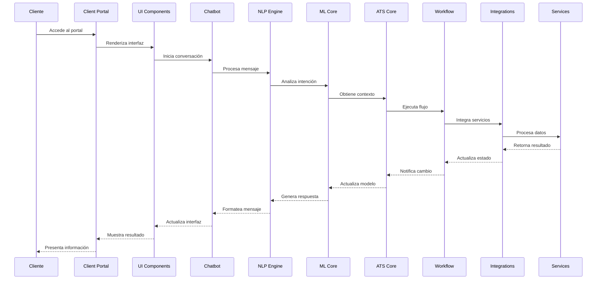

## Flujo de Datos ML

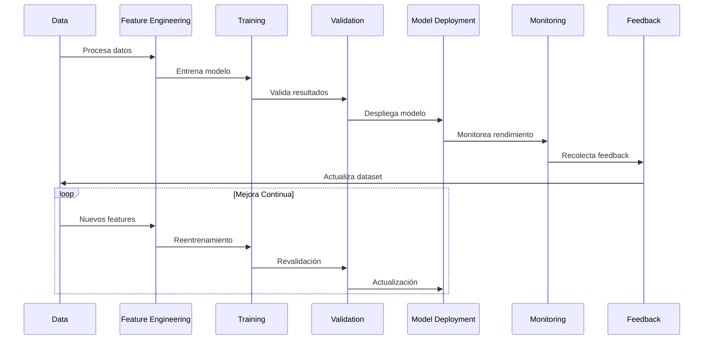

## Arquitectura de Datos Extendida

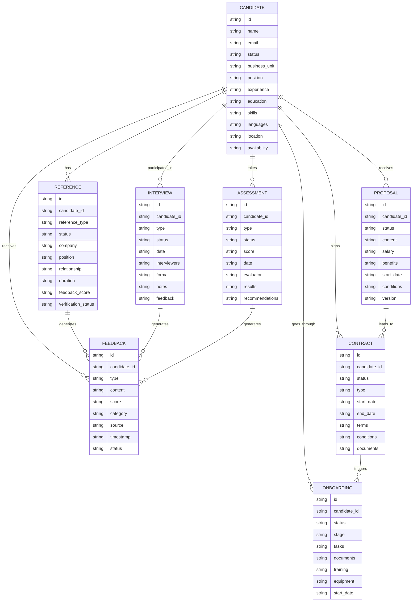

## Descripción de Componentes Detallada

### Frontend
- **Client Portal**: Portal para clientes
  - UI Components: Componentes de interfaz reutilizables
  - Formularios: Gestión de entrada de datos
  - Gráficos: Visualización de datos
  - Notificaciones UI: Sistema de alertas visuales

### ATS Core
- **Chatbot System**:
  - NLP Engine: Procesamiento de lenguaje natural
  - Flow Manager: Gestión de flujos de conversación
  - State Manager: Control de estados

- **Account Management**:
  - Autenticación: Gestión de acceso
  - Roles & Permisos: Control de privilegios
  - Perfiles: Gestión de información de usuario

- **Business Processes**:
  - Workflow Engine: Motor de procesos
  - Task Manager: Gestión de tareas
  - Event System: Sistema de eventos
  - Validators: Validación de datos

### Machine Learning
- **ML Core**:
  - Model Manager: Gestión de modelos
  - Pipeline Manager: Gestión de pipelines
  - Feature Engineering: Ingeniería de características

- **ML Services**:
  - ML API: Interfaz de programación
  - Model Storage: Almacenamiento de modelos
  - Logging: Registro de eventos
  - Metrics Collector: Recolección de métricas

### Integrations
- **API Layer**:
  - Auth: Autenticación API
  - Rate Limiting: Control de tráfico
  - Cache: Almacenamiento en caché

- **Communication**:
  - Email: Servicio de correo
  - SMS: Servicio de mensajes
  - WhatsApp: Integración WhatsApp
  - Web: Comunicación web

- **External Integrations**:
  - HR Systems: Sistemas de RRHH
  - CRM: Gestión de relaciones
  - External ATS: Otros ATS
  - Payment Gateways: Pasarelas de pago

### Services
- **Core Services**:
  - Auth Service: Servicio de autenticación
  - File Service: Gestión de archivos
  - Email Service: Servicio de correo
  - Queue Service: Gestión de colas

- **Utilities**:
  - Logger: Registro de eventos
  - Cache: Almacenamiento en caché
  - Validator: Validación de datos
  - Formatter: Formateo de datos

- **Configuration**:
  - Environment: Variables de entorno
  - Secrets: Gestión de secretos
  - Feature Flags: Control de características

## Arquitectura de Despliegue

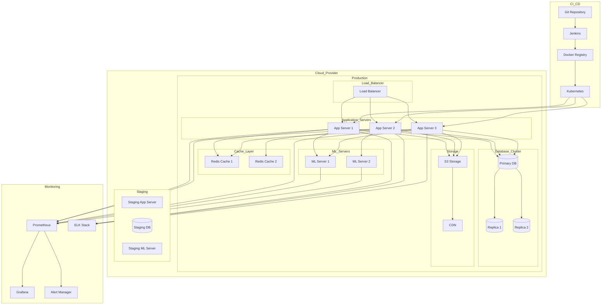

## Arquitectura de Seguridad

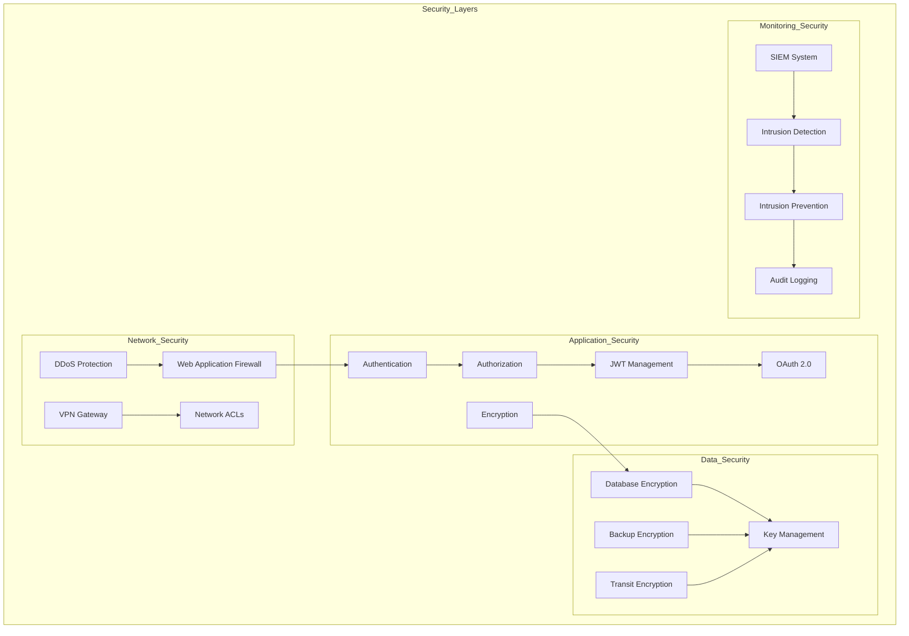

## Flujos por Unidad de Negocio

```mermaid
graph TB
    subgraph huntRED
        HR_CH[Chatbot]
        HR_ML[ML Engine]
        HR_REF[References]
        HR_INT[Interviews]
    end
    
    subgraph Amigro
        AM_CH[Chatbot]
        AM_ML[ML Engine]
        AM_REF[References]
        AM_SALES[Sales Process]
    end
    
    subgraph Huntu
        HU_CH[Chatbot]
        HU_ML[ML Engine]
        HU_TECH[Technical Assessment]
        HU_DEV[Development Process]
    end
    
    subgraph Sexsi
        SX_CH[Chatbot]
        SX_ML[ML Engine]
        SX_CS[Customer Service]
        SX_QA[Quality Assessment]
    end
    
    %% Conexiones huntRED
    HR_CH --> HR_ML
    HR_ML --> HR_REF
    HR_REF --> HR_INT
    
    %% Conexiones Amigro
    AM_CH --> AM_ML
    AM_ML --> AM_REF
    AM_REF --> AM_SALES
    
    %% Conexiones Huntu
    HU_CH --> HU_ML
    HU_ML --> HU_TECH
    HU_TECH --> HU_DEV
    
    %% Conexiones Sexsi
    SX_CH --> SX_ML
    SX_ML --> SX_CS
    SX_CS --> SX_QA
```

## Diagrama de Estados del Candidato

```mermaid
stateDiagram-v2
    [*] --> Applied
    Applied --> Screening
    Screening --> Interview
    Interview --> Technical_Assessment
    Technical_Assessment --> Reference_Check
    Reference_Check --> Offer
    Offer --> Accepted
    Offer --> Rejected
    Accepted --> Onboarding
    Onboarding --> Active
    Active --> Offboarding
    Offboarding --> [*]
    
    state Screening {
        [*] --> Initial_Review
        Initial_Review --> Phone_Screen
        Phone_Screen --> HR_Interview
        HR_Interview --> [*]
    }
    
    state Interview {
        [*] --> First_Round
        First_Round --> Second_Round
        Second_Round --> Final_Round
        Final_Round --> [*]
    }
    
    state Technical_Assessment {
        [*] --> Skills_Test
        Skills_Test --> Technical_Interview
        Technical_Interview --> Code_Review
        Code_Review --> [*]
    }
    
    state Reference_Check {
        [*] --> Request_References
        Request_References --> Collect_References
        Collect_References --> Verify_References
        Verify_References --> [*]
    }
    
    state Onboarding {
        [*] --> Documentation
        Documentation --> Training
        Training --> Equipment_Setup
        Equipment_Setup --> Team_Integration
        Team_Integration --> [*]
    }
```

## Detalles de Integración

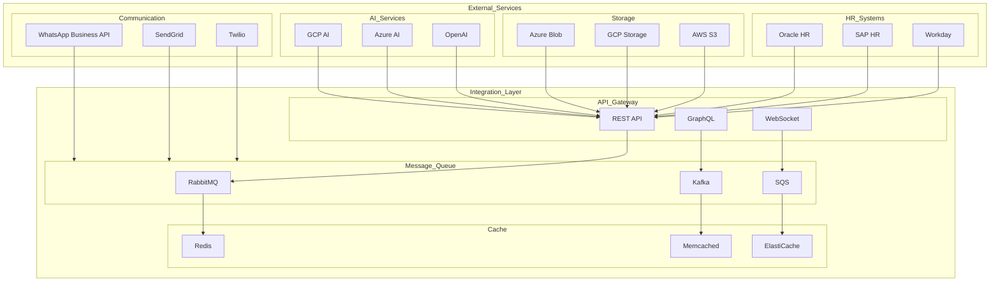

## Detalles de Monitoreo y Logging

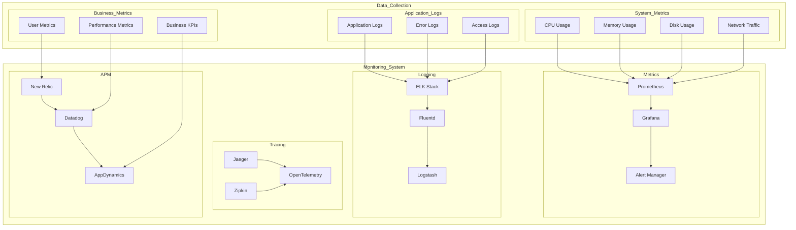

## Detalles de Escalabilidad

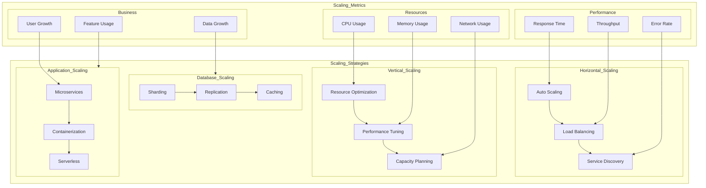

## Arquitectura Detallada del Chatbot

### Diagrama de Componentes del Chatbot

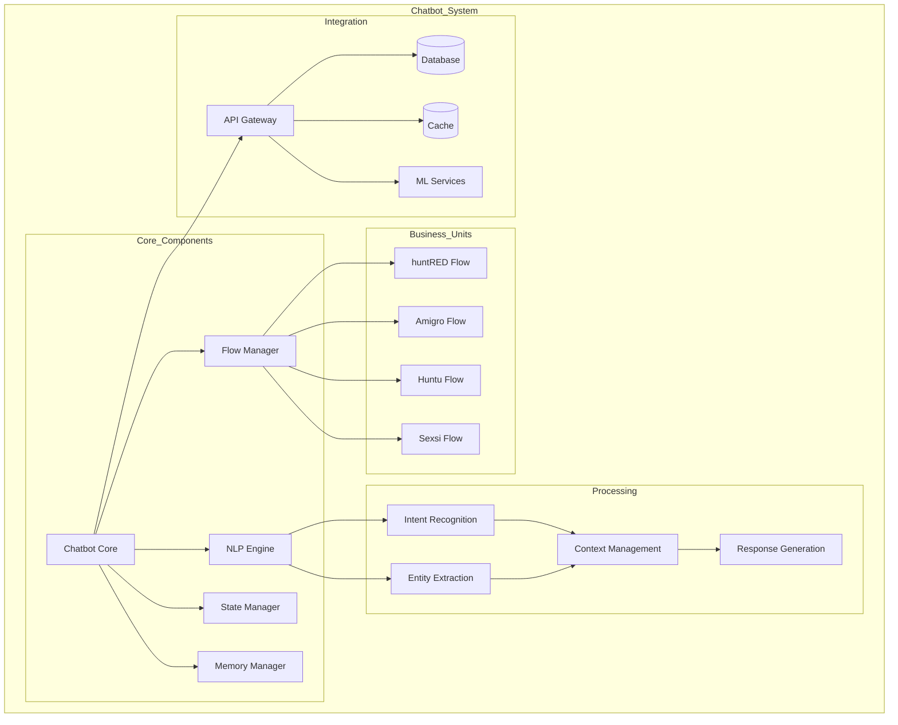

### Flujo de Procesamiento del Chatbot

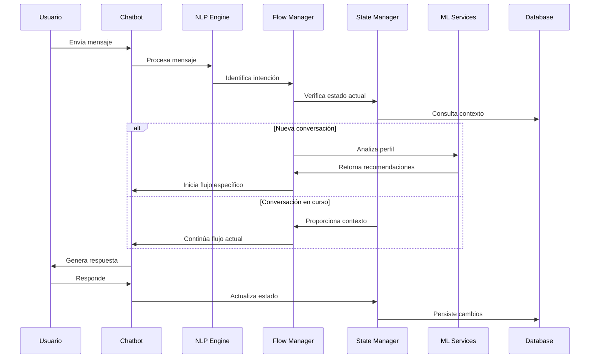

### Estados y Transiciones del Chatbot

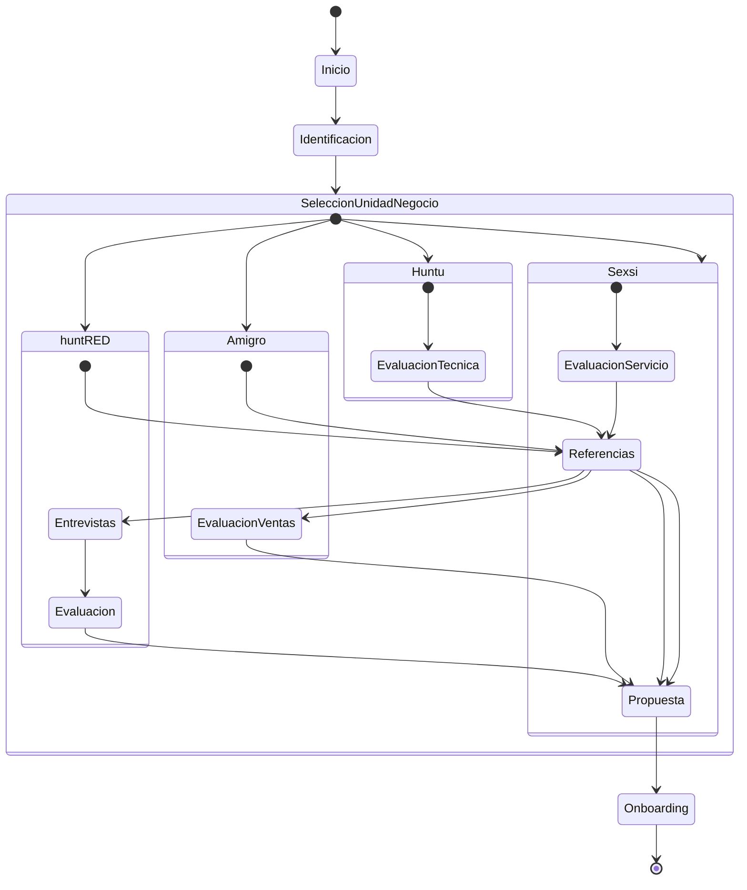

### Integración con Servicios ML

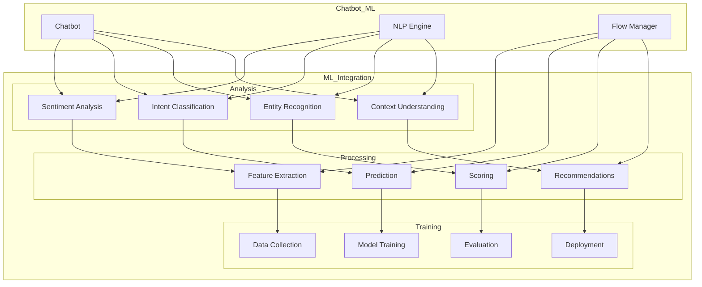

### Gestión de Memoria y Contexto

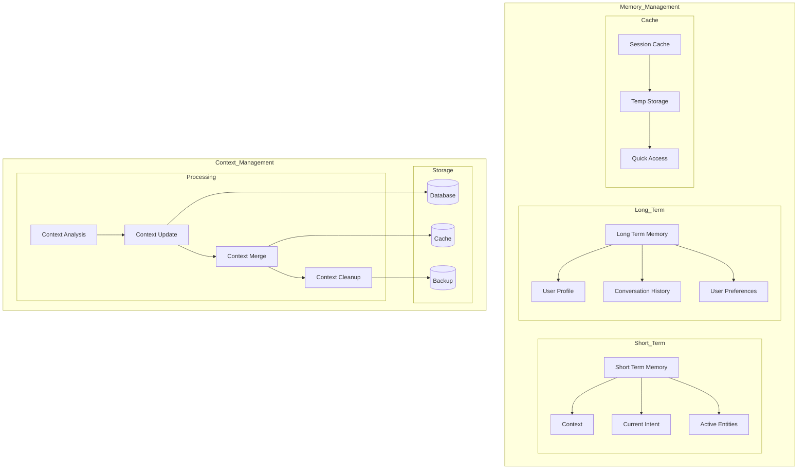

### Flujos de Negocio por Unidad

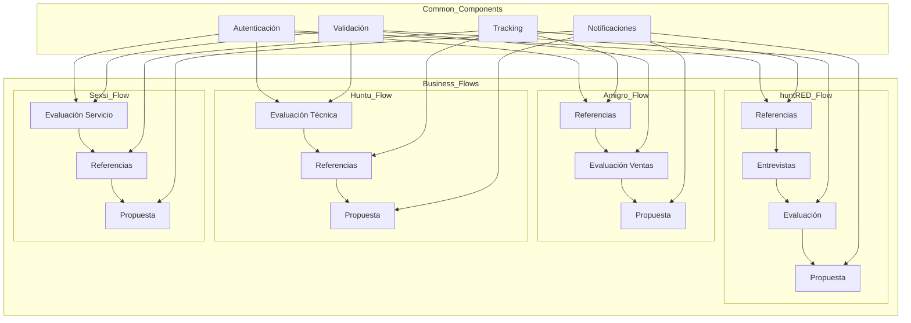

### Descripción de Componentes del Chatbot

#### Core Components
- **Chatbot Core**: Componente principal que orquesta todas las interacciones
- **NLP Engine**: Procesamiento de lenguaje natural y comprensión de intenciones
- **Flow Manager**: Gestión de flujos de conversación y estados
- **State Manager**: Control y persistencia de estados
- **Memory Manager**: Gestión de memoria a corto y largo plazo

#### Business Units
- **huntRED Flow**: Flujo específico para huntRED
- **Amigro Flow**: Flujo específico para Amigro
- **Huntu Flow**: Flujo específico para Huntu
- **Sexsi Flow**: Flujo específico para Sexsi

#### Processing
- **Intent Recognition**: Reconocimiento de intenciones del usuario
- **Entity Extraction**: Extracción de entidades y datos relevantes
- **Context Management**: Gestión del contexto de la conversación
- **Response Generation**: Generación de respuestas apropiadas

#### Integration
- **API Gateway**: Punto de entrada para servicios externos
- **Database**: Almacenamiento persistente
- **Cache**: Almacenamiento en caché para mejor rendimiento
- **ML Services**: Servicios de machine learning

### Flujos de Proceso Detallados

#### Flujo de Referencias
1. Identificación de referencias necesarias
2. Validación de datos de contacto
3. Envío de solicitudes
4. Seguimiento de respuestas
5. Procesamiento de feedback

#### Flujo de Evaluación
1. Análisis de perfil
2. Evaluación técnica/personal
3. Validación de resultados
4. Generación de reportes

#### Flujo de Propuestas
1. Preparación de propuesta
2. Validación de términos
3. Envío al candidato
4. Seguimiento de respuesta

### Integración con ML

#### Análisis
- Análisis de sentimiento
- Clasificación de intenciones
- Reconocimiento de entidades
- Comprensión de contexto

#### Procesamiento
- Extracción de características
- Predicción de resultados
- Scoring de candidatos
- Recomendaciones personalizadas

#### Entrenamiento
- Recolección de datos
- Entrenamiento de modelos
- Evaluación de rendimiento
- Despliegue de actualizaciones

### Gestión de Memoria y Contexto

#### Memoria a Corto Plazo
- Contexto actual
- Intención actual
- Entidades activas

#### Memoria a Largo Plazo
- Perfil de usuario
- Historial de conversaciones
- Preferencias del usuario

#### Caché
- Caché de sesión
- Almacenamiento temporal
- Acceso rápido

### Flujos de Negocio

#### huntRED
1. Referencias
2. Entrevistas
3. Evaluación
4. Propuesta

#### Amigro
1. Referencias
2. Evaluación de ventas
3. Propuesta

#### Huntu
1. Evaluación técnica
2. Referencias
3. Propuesta

#### Sexsi
1. Evaluación de servicio
2. Referencias
3. Propuesta

### Componentes Comunes
- Autenticación
- Validación
- Notificaciones
- Tracking 